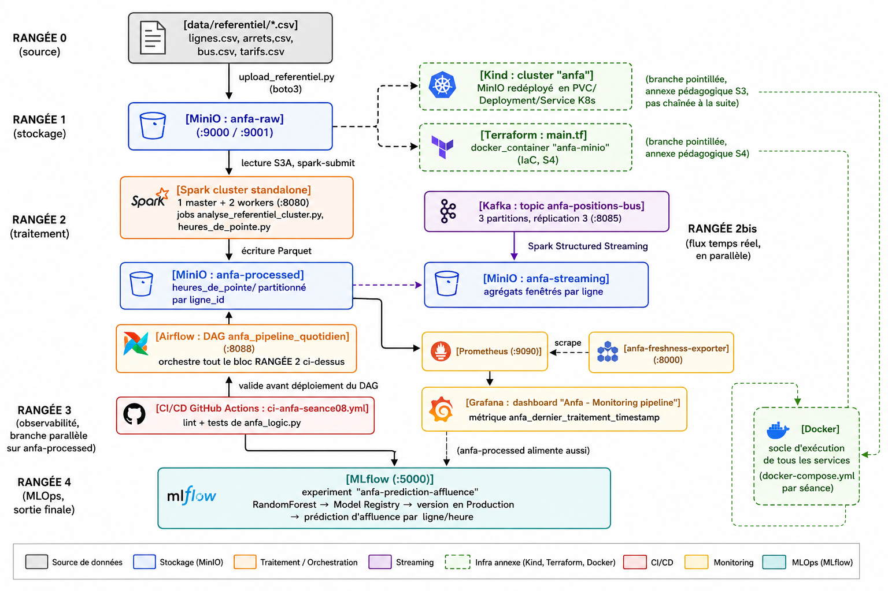
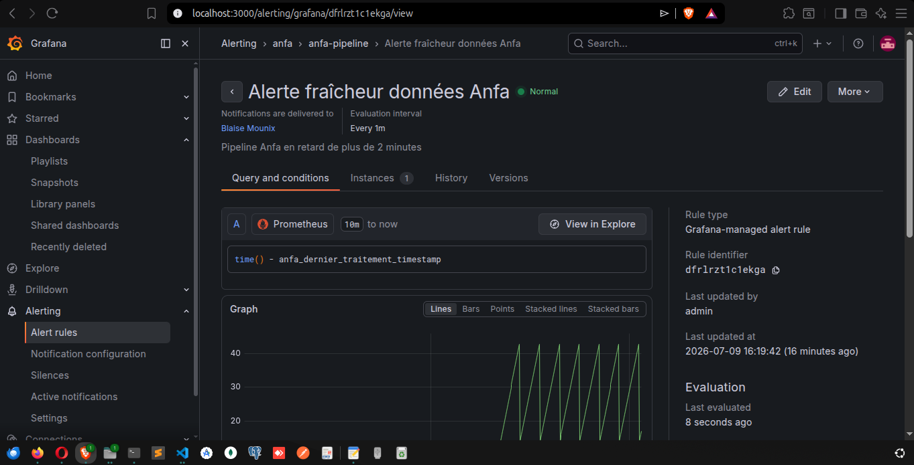
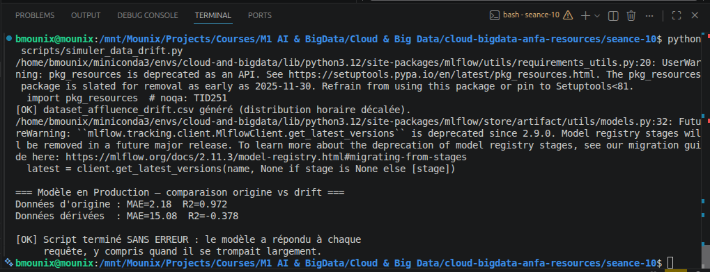

# Rapport de synthèse : plateforme de données Anfa

**Nom et prénom :** BLAISE Mouné Tchoubou
**Identifiant GitHub :** Mounix756
**Cours :** Cloud & Big Data, ESGIS, M1 IA & Big Data, 2025-2026

---

## Partie 1 : Cartographie de ma plateforme

### Vue d'ensemble

Ce rapport documente la plateforme que j'ai construite séance après séance pour Anfa, la société fictive de transport par bus de Lomé. Chaque brique a été testée dans mon propre environnement, avec mes propres noms de ressources : le bucket `anfa-raw`, le topic Kafka `anfa-positions-bus`, le DAG `anfa_pipeline_quotidien`, l'expérience MLflow `anfa-prediction-affluence`. Le schéma ci-dessous relie les 10 briques du cours et montre le chemin réel que suit la donnée, du référentiel CSV jusqu'au modèle de prédiction d'affluence.

### Le chemin de la donnée, brique par brique

Tout part de `data/referentiel/` : quatre fichiers CSV (`lignes.csv`, `arrets.csv`, `bus.csv`, `tarifs.csv`) qui décrivent le réseau de bus d'Anfa. En séance 1, le script `upload_referentiel.py` les dépose dans MinIO via boto3, dans le bucket `anfa-raw`, accessible sur le port 9000 pour l'API S3 et 9001 pour la console web. C'est la première brique et la source de vérité de tout ce qui suit.

En séance 3, j'ai redéployé MinIO sur un cluster Kind (nommé `anfa`), avec un PVC, un Deployment et un Service Kubernetes. En séance 4, j'ai fait la même chose en Infrastructure as Code avec Terraform, cette fois en pilotant directement le provider Docker. Ces deux briques sont volontairement représentées en branches annexes sur le schéma, et pas dans le flux principal : elles ont servi à apprendre Kubernetes et l'IaC sur mon service déjà existant, mais je n'ai pas rebasculé la suite du semestre dessus. À partir de la séance 5, tout retourne sur du Docker Compose classique. Je préfère l'assumer clairement plutôt que de dessiner un schéma qui ferait croire que Kind ou Terraform pilotent réellement la plateforme aujourd'hui.

En séance 5, un cluster Spark standalone (1 master, 2 workers, dashboard sur le port 8080) lit le référentiel depuis `anfa-raw` via le connecteur S3A et calcule des statistiques (bus par ligne, heures de pointe). Les résultats sont écrits en Parquet dans le bucket `anfa-processed`, partitionnés par `ligne_id` pour le job `heures_de_pointe.py`. En séance 6, j'ai orchestré cette chaîne avec Airflow : le DAG `anfa_pipeline_quotidien` enchaîne génération des trajets, soumission du job Spark, vérification des résultats et notification, avec des retries configurés et un comportement `upstream_failed` observable en cas d'échec.

En parallèle de ce pipeline batch, la séance 7 ajoute un flux temps réel : un cluster Kafka à 3 brokers en mode KRaft, avec le topic `anfa-positions-bus` (3 partitions, réplication 3), reçoit les positions GPS simulées de 100 bus. Spark Structured Streaming consomme ce flux et écrit des agrégats fenêtrés dans un troisième bucket, `anfa-streaming`.

La séance 8 ajoute une porte de contrôle avant tout déploiement : le workflow GitHub Actions `ci-anfa-seance08.yml` fait tourner flake8 et pytest sur `anfa_logic.py`, la logique métier extraite du DAG, avant d'autoriser le job de déploiement simulé.

La séance 9 surveille la santé du pipeline lui-même : l'exportateur `anfa-freshness-exporter` expose sur le port 8000 la métrique `anfa_dernier_traitement_timestamp`, scrapée par Prometheus (port 9090) et affichée dans un dashboard Grafana dédié, avec une alerte configurée sur le seuil de fraîcheur.

Enfin, la séance 10 ferme la boucle côté MLOps : un serveur MLflow (port 5000) trace les runs d'entraînement d'un modèle RandomForest qui prédit l'affluence par ligne et par heure, dans l'expérience `anfa-prediction-affluence`. Le meilleur run est enregistré dans le Model Registry et promu en statut Production. C'est la destination finale du chemin de la donnée : du CSV brut à une prédiction consommable par une application.

Docker n'apparaît nulle part comme une étape isolée sur le schéma, parce qu'il est présent partout : chaque brique, de MinIO à MLflow, tourne dans un conteneur défini par un `docker-compose.yml` propre à sa séance. C'est le socle sur lequel tout le reste repose, pas un maillon de la chaîne.

### Captures par brique

| # | Brique | Capture | Ce qu'elle montre |
|---|--------|---------|-------------------|
| 1 | MinIO | `assets/01-minio.png` | Bucket `anfa-raw` avec les 4 CSV du référentiel |
| 2 | Docker | `assets/02-docker.png` | `docker compose ps -a`, stack MinIO + Jupyter + anfa-app |
| 3 | Kind | `assets/03-kind.png` | Scaling du Deployment MinIO à 3 replicas sur le cluster `anfa` |
| 4 | Terraform | `assets/04-terraform.png` | `terraform apply` créant l'infra MinIO en IaC |
| 5 | Spark | `assets/05-spark.png` | Dashboard Spark Master, 2 workers ALIVE |
| 6 | Airflow | `assets/06-airflow.png` | Graph view du DAG `anfa_pipeline_quotidien` en succès |
| 7 | Kafka | `assets/07-kafka.png` | Kafka UI, 3 brokers actifs |
| 8 | CI/CD | `assets/08-cicd.png` | GitHub Actions, les 2 jobs en succès |
| 9 | Prometheus/Grafana | `assets/09-monitoring.png` | Gauge de fraîcheur des données, état normal |
| 10 | MLflow | `assets/10-mlflow.png` | Modèle `anfa-prediction-affluence` en statut Production |

---

## Partie 2 : Le journal des arbitrages

Cinq choix techniques rencontrés pendant les TP, avec la décision prise, l'alternative écartée, et ce qui casserait si j'avais fait l'inverse.

### 2.1 Kind plutôt que Minikube (séance 3)

**Décision.** Pour déployer MinIO sur un cluster Kubernetes local, j'ai utilisé Kind, où chaque nœud du cluster est lui-même un conteneur Docker (image `kindest/node`).

**Alternative écartée.** Minikube, qui lance une VM complète (VirtualBox, KVM, ou driver Docker) pour héberger le cluster.

**Ce qui casserait si j'avais fait l'inverse.** Fonctionnellement, l'exercice (self-healing, scaling, Ingress) aurait marché avec Minikube aussi. Mais toute la continuité du semestre repose sur un seul daemon Docker partagé : MinIO en Compose (S1-2), le provider Docker de Terraform (S4), puis Spark, Airflow et Kafka en Compose (S5-9). Minikube ajoute une couche de virtualisation supplémentaire par-dessus une machine déjà sollicitée (j'ai eu des soucis d'espace disque dès la séance 5 avec la seule stack Spark), et son cluster Docker interne, séparé de celui de l'hôte, aurait cassé cette continuité entre les briques.

### 2.2 Provider Docker de Terraform plutôt qu'un provider cloud (séance 4)

**Décision.** J'ai utilisé le provider `kreuzwerker/docker` pour provisionner en IaC un réseau, un volume et un conteneur MinIO, en local.

**Alternative écartée.** Un provider cloud comme AWS, pour provisionner de vraies ressources (bucket S3, instance EC2, etc.).

**Ce qui casserait si j'avais fait l'inverse.** Il aurait fallu un compte AWS pour chaque étudiant, avec des identifiants à sécuriser correctement (exactement le problème que le TP enseignait déjà à éviter avec `terraform.tfvars`), un risque de facturation réelle en cas d'oubli d'un `terraform destroy`, et une dépendance à la disponibilité d'internet et de l'API AWS pendant le cours. Ça aurait aussi mélangé deux apprentissages différents dans la même séance : la mécanique de Terraform (state, plan, apply, idempotence) et le modèle de ressources AWS, alors que le provider Docker permet de se concentrer uniquement sur le premier.

### 2.3 spark-submit piloté via le socket Docker plutôt que le SparkSubmitOperator officiel (séance 6)

**Décision.** Dans le DAG `anfa_pipeline_quotidien`, la tâche qui lance le job Spark utilise le SDK Docker Python (`docker.from_env()`) pour exécuter `spark-submit` directement dans le conteneur `anfa-spark-master`, via le socket `/var/run/docker.sock` monté dans Airflow.

**Alternative écartée.** Le `SparkSubmitOperator` fourni par le provider Airflow-Spark officiel.

**Ce qui casserait si j'avais fait l'inverse.** Le `SparkSubmitOperator` a besoin d'un client Spark (donc Java) installé localement dans le conteneur qui l'exécute, ici Airflow. Ça aurait obligé à installer une JVM et une distribution Spark complète dans l'image Airflow, alors qu'elle existe déjà dans l'image `anfa-spark-master`. Résultat : une image Airflow considérablement plus lourde, une dépendance dupliquée entre deux images à maintenir en synchronisation de version, pour un job qui de toute façon doit s'exécuter sur le cluster Spark et non dans le conteneur Airflow. Piloter via le socket Docker garde Airflow « léger » (uniquement de l'orchestration) et délègue l'exécution réelle au conteneur déjà équipé pour ça.

### 2.4 Logique métier isolée dans anfa_logic.py plutôt que testée directement dans Airflow (séance 8)

**Décision.** Les fonctions utilisées par les tâches du DAG ont été extraites dans un module `anfa_logic.py` indépendant, testé avec pytest sans importer Airflow.

**Alternative écartée.** Écrire des tests qui instancient directement des objets DAG et des opérateurs Airflow réels.

**Ce qui casserait si j'avais fait l'inverse.** Tester directement dans Airflow aurait obligé à installer le paquet `apache-airflow` complet dans le runner CI, une dépendance volumineuse et sensible aux versions, rien que pour vérifier qu'une fonction de calcul retourne le bon résultat. Chaque push aurait été plus lent, et le risque que la CI casse à cause d'un problème de packaging Airflow sans rapport avec un vrai bug de logique métier aurait augmenté. Séparer les deux garde les tests rapides et concentrés sur ce qu'ils sont censés vérifier.

### 2.5 network_mode: host pour MLflow plutôt que continuer à corriger le bridge Docker (séance 10)

**Décision.** Après avoir désinstallé Docker Desktop pour repasser sur Docker Engine natif, le conteneur MLflow n'arrivait plus à joindre PyPI (`pip install` échouait avec `Network is unreachable`). Un diagnostic complet (règles iptables, nftables, conntrack, comparaison hôte/conteneur, test IPv6) a fini par isoler la vraie cause : le WiFi que j'utilise filtre spécifiquement le trafic TCP routé et masqueradé par le bridge Docker, alors que le trafic émis directement par l'hôte passe sans problème. J'ai basculé le service MLflow en `network_mode: host` dans le `docker-compose.yml`, ce qui fait sortir le conteneur directement par la carte réseau de la machine, en court-circuitant le bridge.

**Alternative écartée.** Continuer à corriger le bridge Docker lui-même (règles iptables par réseau, réglage du sysctl IPv6 par défaut), ce que j'ai d'ailleurs commencé à faire avant de comprendre que le problème ne venait pas de la configuration locale.

**Ce qui casserait si j'avais fait l'inverse.** Le dépôt contient déjà, dans mes propres RENDU des séances 5, 7 et 9, des règles iptables ajoutées à la main pour donner l'accès internet aux conteneurs, à recréer à chaque fois que Docker régénère un nouveau bridge avec un nom différent. Continuer sur cette voie pour la séance 10 aurait juste ajouté un rafistolage de plus à un problème qui ne se trouve pas sur ma machine mais sur le réseau du WiFi. `network_mode: host` élimine toute cette classe de problèmes pour ce conteneur précis, au prix de perdre l'isolation réseau que Docker offre normalement, ce qui reste acceptable pour un serveur MLflow local à un seul utilisateur, mais que je ne ferais pas pour un service exposé en production multi-utilisateurs.

## Partie 3 : Analyse du fil rouge « ça tourne mais c'est inutile »

Trois séances du semestre m'ont montré la même chose sous trois formes différentes : un système peut fonctionner parfaitement du point de vue technique (aucune exception, aucun crash, un statut vert) tout en produisant un résultat inutile ou faux. Voici les trois pannes que j'ai moi-même déclenchées, puis ce qu'elles ont en commun avec les offsets Kafka et le state Terraform.

### Panne 1 : Airflow, échec silencieusement propagé (séance 6)

En lançant le DAG `anfa_pipeline_quotidien`, la tâche `analyser_heures_pointe` a échoué parce qu'Airflow n'avait pas les droits sur `/var/run/docker.sock`, nécessaire pour soumettre le job Spark. Les retries configurés dans `default_args` se sont déclenchés automatiquement, et une fois épuisés, les tâches suivantes (`verifier_resultats`, `notifier`) sont passées en `upstream_failed` plutôt que de s'exécuter comme si de rien n'était. Une fois le problème de permissions corrigé (`chmod 666`), le pipeline est reparti normalement.

Le point important n'est pas la panne elle-même, mais ce qu'un statut vert cache si le pipeline n'est pas idempotent. Si `analyser_heures_pointe` avait écrit ses résultats en mode `append` plutôt qu'`overwrite`, un retry qui réussit après un premier échec partiel aurait pu dupliquer des lignes dans `anfa-processed`, tout en affichant fièrement un statut `success`. Le vert d'Airflow signifie « le code s'est exécuté sans lever d'exception », pas « le résultat est correct ».

### Panne 2 : fraîcheur des données, la panne qu'Airflow ne voit pas (séance 9)

J'ai arrêté le conteneur `anfa-freshness-exporter` avec `docker stop`. La métrique `anfa_dernier_traitement_timestamp` a cessé de se mettre à jour, le gauge Grafana est passé de l'état normal à l'état « stale », et l'alerte configurée à 120 secondes est passée en `No data` (pas en `Firing`, puisque sans donnée récente, Prometheus ne peut pas évaluer si le seuil est dépassé). Après avoir relancé l'exporter, tout est revenu à `Normal` en une trentaine de secondes.

Ce qui rend cette panne intéressante, c'est que rien dans Airflow lui-même n'aurait signalé le problème : la dernière exécution du DAG était un succès, son historique reste vert indéfiniment tant qu'on ne relance pas le DAG. Seul un système complètement séparé, qui mesure l'âge de la donnée plutôt que le statut de la dernière exécution, peut détecter qu'aujourd'hui, rien de neuf n'est arrivé.

### Panne 3 : data drift, le modèle qui répond mal sans jamais se tromper de code (séance 10, bonus)

En chargeant le modèle `anfa-prediction-affluence` en Production et en le confrontant à un dataset dont les heures de pointe sont décalées de 2h, j'ai observé le MAE passer de 2,18 à 15,08 et le R² passer de 0,972 à -0,378 (un R² négatif signifie que le modèle prédit moins bien qu'une simple moyenne constante). Le script s'est terminé normalement dans les deux cas, sans la moindre exception.

C'est la version la plus pure du principe : `modele.predict()` ne peut techniquement pas échouer sur des données valides, il retourne toujours un nombre. Rien dans l'appel lui-même ne distingue une bonne prédiction d'une mauvaise. Le succès logiciel (pas de crash) et le succès statistique (une prédiction utile) sont deux choses complètement indépendantes, et c'est précisément ce que le Model Registry, à lui seul, ne surveille pas : il garantit qu'on sait quelle version tourne, pas que cette version est encore pertinente pour les données d'aujourd'hui.

### Le lien avec les offsets Kafka et le state Terraform

Ces trois pannes partagent un principe que j'ai retrouvé sous une autre forme dans deux séances qui, à première vue, n'ont rien à voir avec du monitoring : les offsets Kafka (séance 7) et le state Terraform (séance 4).

Un offset Kafka n'est pas une estimation de ce qu'un consumer a probablement lu, c'est un enregistrement exact et persisté de la dernière position confirmée pour un `group_id` donné. Quand j'ai relancé `premier_consumer.py` avec le même `group_id`, aucun message n'a été relu, parce que Kafka savait précisément où le groupe s'était arrêté. Sans cet enregistrement, un consumer qui redémarre après un crash devrait présumer où il en était, au risque de sauter des messages ou de les traiter deux fois, sans qu'aucune erreur ne le signale.

Le `terraform.tfstate` joue exactement le même rôle pour l'infrastructure : il ne décrit pas ce que le code `.tf` a l'intention de créer, il enregistre ce qui existe réellement, tel que Terraform l'a constaté la dernière fois. C'est ce qui permet à `terraform plan` de calculer un vrai diff plutôt que de présumer que le code correspond à la réalité du terrain.

Dans les trois pannes comme dans ces deux mécanismes, l'idée est la même : ne jamais faire confiance à une hypothèse sur l'état du système quand on peut à la place garder une trace vérifiable de cet état. Un statut vert, une exécution qui ne plante pas, ou un code qui décrit une intention ne sont pas des preuves. Un offset, un state, une métrique de fraîcheur ou une comparaison de métriques dans le temps le sont.

## Partie 4 : Le passage au cloud réel

Le cours répète que le code est transposable tel quel vers un cloud public. Pour vérifier cette promesse, je pars des volumes réels d'Anfa tels que je les ai manipulés en TP : environ 100 bus, 12 lignes, 79 368 trajets simulés sur 30 jours en séance 5, des jobs Spark qui tournent en 46 à 52 secondes sur un cluster minimal, et des fichiers Parquet de quelques mégaoctets. C'est une petite plateforme, et ça change beaucoup de choses sur les coûts réels.

### MinIO vers Amazon S3

**Ce qui change.** Très peu de code, en fait. MinIO expose une API compatible S3, donc `upload_referentiel.py` et le connecteur S3A utilisé par Spark fonctionnent presque sans modification : il suffit de retirer l'`endpoint_url` personnalisé et de remplacer `anfa-app-key`/`anfa-app-secret-2026` par de vraies clés IAM. Ce qui disparaît, c'est la gestion du serveur lui-même : plus de conteneur à surveiller, plus de volume Docker dont l'espace disque peut se remplir (ce qui m'est arrivé en séance 5), une durabilité largement supérieure à un disque local.

**Ce qui coûte de l'argent.** Le stockage au Go par mois, les requêtes PUT/GET/LIST (marginales mais non nulles), et surtout la sortie de données vers internet, qu'on ne paie jamais avec MinIO en local.

**Ordre de grandeur.** Pour les quelques Go de données réelles d'Anfa (référentiel, Parquet agrégés, artefacts MLflow), le stockage seul coûterait entre 1 et 5 dollars par mois. Les requêtes ajoutent quelques dollars. Le poste qui peut vraiment grimper, c'est la sortie de données si une application mobile ou un dashboard va chercher des données hors d'AWS régulièrement. Au global, je resterais probablement sous les 20 à 30 dollars par mois à cette échelle.

**Vendor lock-in.** L'API S3 est devenue un standard de fait, donc le code applicatif reste portable. Mais dès qu'on commence à utiliser les à-côtés (politiques IAM, règles de lifecycle, notifications d'événements S3 qui déclenchent une Lambda), on retisse des dépendances propres à AWS qui n'ont pas d'équivalent identique chez GCS ou Azure Blob. Et les frais de sortie rendent coûteux le simple fait de vouloir un jour récupérer ses propres données pour partir ailleurs.

### Kind vers EKS ou GKE

**Ce qui change.** Les nœuds ne sont plus des conteneurs sur mon ordinateur mais de vraies machines virtuelles (EC2 ou GCE), avec un vrai load balancer cloud pour les services de type `LoadBalancer`, et des volumes persistants réels (EBS ou Persistent Disk) à la place du provisioner local éphémère de Kind.

**Ce qui coûte de l'argent.** Sur EKS, le control plane facture un tarif fixe d'environ 0,10 dollar de l'heure, soit environ 73 dollars par mois, même si le cluster n'héberge qu'un seul petit pod. GKE offre le control plane d'un premier cluster zonal gratuitement, ce qui change beaucoup la donne. Dans les deux cas, il faut ensuite ajouter les nœuds de calcul (15 à 30 dollars par mois pour une petite instance) et un load balancer cloud (autour de 18 dollars par mois côté AWS pour un Network Load Balancer).

**Ordre de grandeur.** Pour reproduire simplement ce que j'ai fait en séance 3 (MinIO seul sur le cluster), EKS reviendrait à environ 120 à 150 dollars par mois, presque entièrement composés de frais fixes plutôt que d'usage réel. GKE serait plus proche de 50 à 100 dollars grâce au control plane gratuit. Dans les deux cas, c'est très cher pour héberger un seul service qui tournait gratuitement sur mon laptop.

**Vendor lock-in.** Kubernetes lui-même est la promesse de portabilité, les mêmes manifestes YAML tournent partout. Ce qui casse cette promesse, ce sont les briques qui rendent le cluster réellement utilisable en production : IRSA côté AWS ou Workload Identity côté GCP pour donner des droits IAM aux pods, les StorageClasses spécifiques à chaque cloud (gp3 contre pd-ssd), l'intégration de l'autoscaling avec l'API de VM du fournisseur. Le déploiement est portable, la colle autour ne l'est pas.

### Spark standalone vers EMR ou Dataproc

**Ce qui change.** Le code PySpark lui-même (`analyse_referentiel_cluster.py`, `heures_de_pointe.py`) reste quasiment identique. Ce qui change, c'est tout ce qu'il y a autour : plus besoin de télécharger manuellement les paquets Maven `hadoop-aws` et `aws-java-sdk-bundle` au premier `spark-submit`, ce qui m'avait pris plus de 4 minutes en séance 5 et posé des soucis réseau en séance 7, puisque EMR et Dataproc embarquent déjà les connecteurs vers S3 ou GCS. En contrepartie, la soumission de jobs passe par une API propre à chaque service (les steps EMR ou l'API de jobs Dataproc), à la place du socle Docker que j'utilise aujourd'hui.

**Ce qui coûte de l'argent.** Les heures d'instance EC2 ou GCE pour le master et les workers, plus une surcharge de gestion qu'EMR et Dataproc ajoutent par-dessus le prix brut du calcul, de l'ordre de 20 à 25 %.

**Ordre de grandeur.** Un cluster EMR ou Dataproc éphémère, lancé chaque nuit pendant une trentaine de minutes pour coller au planning du DAG `anfa_pipeline_quotidien`, coûterait seulement quelques dollars par mois en calcul brut vu que mes jobs tournent en moins d'une minute. Mais le temps de démarrage du cluster (plusieurs minutes avant même le premier job) ajoute un coût et une latence non négligeables face à un cluster standalone déjà démarré. Un cluster permanent, à l'inverse, coûterait facilement 200 à 400 dollars par mois pour rester allumé toute la journée alors qu'il ne travaille que 2 à 3 minutes.

**Vendor lock-in.** Le code Spark est réellement portable, c'est la vraie force de l'écosystème. Mais l'orchestration autour ne l'est pas : les steps EMR et les jobs Dataproc ont des API différentes entre elles et différentes du socle Docker que j'utilise aujourd'hui, les rôles IAM pour accéder à S3 n'ont pas d'équivalent identique aux comptes de service pour GCS, et les politiques d'autoscaling sont propres à chaque plateforme. Migrer d'AWS vers GCP demanderait de réécrire cette couche d'orchestration en entier, même si les fichiers `.py` du job Spark ne bougent pas.

### Ce que ça change à l'analyse

Sur les trois briques, le même schéma se répète : le code applicatif est effectivement portable, ce n'est pas un mensonge du cours. Ce qui ne l'est pas, c'est la couche de gestion (IAM, réseau, cycle de vie des clusters, facturation) que chaque cloud impose autour. Et à l'échelle réelle d'Anfa, une centaine de bus et quelques gigaoctets de données, cette couche de gestion coûte souvent plus cher que les ressources qu'elle gère : les frais fixes d'un control plane EKS ou d'un cluster EMR permanent dépassent largement ce que justifierait le volume réel de données ou de calcul. Pour la taille actuelle de la plateforme, je recommanderais de rester sur une infrastructure plus légère (quelques VM standard avec Docker Compose, MinIO et Spark standalone), et de ne migrer vers des services pleinement managés que lorsque le volume de bus, de trajets ou de passagers justifiera réellement cette dépense fixe.

## Partie 5 : Souveraineté et conformité

La future application mobile Anfa collecterait la géolocalisation des passagers et leur historique mobile money, exactement le scénario que j'ai traité dans la fiche de conformité de la séance 10. La question de l'hébergement n'est pas un détail technique ici : ces deux données combinées permettent de reconstituer à la fois les déplacements et la situation financière d'une personne, ce qui en fait un cas d'école pour juger où placer le curseur entre coût, conformité et souveraineté.

### Les trois options, pesées

**Cloud américain.** C'est l'option la moins chère et la plus rapide à mettre en œuvre, avec l'écosystème le plus complet (celui que j'ai utilisé pour les estimations de la Partie 4). Le problème n'est pas technique, il est juridique : le CLOUD Act permet aux autorités américaines d'exiger l'accès aux données d'un fournisseur américain, où que ses serveurs soient physiquement installés. Pour des données GPS et financières de citoyens togolais, ça crée une exposition directement en tension avec l'esprit de la loi 2019-014.

**Cloud européen.** La loi togolaise 2019-014 s'inspire largement des mêmes principes que le RGPD (finalité, minimisation, droits des personnes), ce qui rend un hébergement européen plus cohérent sur le papier qu'un hébergement américain. C'est aussi une infrastructure mature, avec des liaisons correctes vers l'Afrique de l'Ouest. Mais ça reste une juridiction étrangère : l'autorité togolaise de protection des données n'a pas de pouvoir d'audit ou d'exécution direct sur un datacenter en France ou en Allemagne, et l'esprit de souveraineté numérique porté par la Convention de Malabo n'est pas vraiment satisfait par le simple fait de changer de continent de destination.

**Hébergement local à Lomé ou régional ouest-africain.** C'est la seule option qui place les données sous une juridiction où l'autorité togolaise a un pouvoir de contrôle réel, sans aucune question de transfert transfrontalier. Elle correspond directement à l'esprit de la Convention de Malabo, et elle rejoint aussi la logique déjà en place pour l'historique mobile money, qui relève d'un cadre réglementaire local (traçabilité, lutte anti-blanchiment) pensé pour un contrôle national. Le vrai coût est opérationnel : construire ou louer une infrastructure fiable à Lomé, avec une redondance correcte face aux aléas du réseau électrique, demande des efforts qu'un hyperscaler abstrait complètement.

### Mon choix

Je retiendrais l'hébergement local ou régional ouest-africain pour les deux données sensibles du scénario, la géolocalisation et l'historique mobile money, même si ce n'est pas l'option la moins chère. La combinaison de ces deux données est justement ce qui fait basculer la balance : ce n'est pas une télémétrie technique anonyme comme les métriques de fraîcheur de la séance 9, c'est une donnée qui identifie directement une personne, révèle ses habitudes de déplacement et sa situation financière. À ce niveau de sensibilité, je privilégierais la conformité et la souveraineté sur l'économie, quitte à payer plus cher et à accepter une infrastructure moins élastique qu'un hyperscaler.

Ce choix n'est pas absolu pour autant. Pour les composants moins sensibles de la plateforme, comme le référentiel des lignes et arrêts qui est une donnée publique, ou les artefacts d'entraînement du modèle de la séance 10 une fois anonymisés, un cloud moins coûteux reste défendable, dans la même logique que la Partie 4 : ne pas payer le prix d'une infrastructure élastique et mondiale pour des données qui n'en ont pas besoin. Le curseur se déplace en fonction de la sensibilité de la donnée, pas d'un principe unique appliqué à toute la plateforme.

Le risque que j'assume avec ce choix, c'est la fiabilité : une infrastructure locale à Lomé n'aura probablement pas la redondance multi-zone d'AWS ou GCP, et Anfa devra investir dans une vraie continuité de service (onduleurs, générateur de secours, réplication vers un second site) plutôt que de la recevoir gratuitement avec l'abonnement. Mais pour des données qui touchent directement à la vie privée et à la situation financière de passagers togolais, je préfère ce risque opérationnel, gérable, à un risque juridique de souveraineté qui ne l'est pas.
