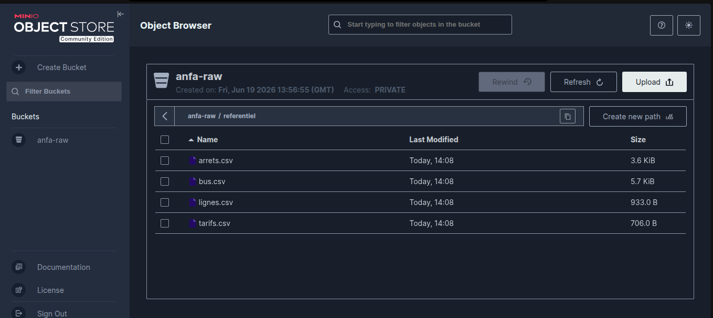

# Rendu Séance 1

**Nom et prénom :** BLAISE Mouné Tchoubou  
**Identifiant GitHub :** Mounix756  
**Branche :** `seance-01`

---

## Résumé de la séance

Dans cette séance, j'ai mis en place un stockage objet local avec MinIO via Docker, puis j'ai écrit un script Python pour y déposer les fichiers CSV du référentiel Anfa. En parallèle, les exercices m'ont permis de revoir les concepts fondamentaux du cloud : modèles de service (IaaS, PaaS, SaaS, FaaS), modèles de déploiement, et les 5 caractéristiques NIST.

---

## Étapes principales

1. Vérification que Docker fonctionne (`docker --version` et `docker compose version`).
2. Fork du dépôt `cloud-bigdata-anfa-resources` et clonage en local.
3. Création de la branche `seance-01` et du dossier `seance-01/`.
4. Téléchargement de l'image MinIO et lancement du conteneur `anfa-minio` sur les ports 9000 et 9001.
5. Entrée dans le conteneur via `docker exec`, configuration de `mc`, création du bucket `anfa-raw` et génération des clés applicatives `anfa-app-key` / `anfa-app-secret-2026`.
6. Création de l'environnement virtuel Python, installation de `boto3`, écriture et exécution du script `upload_referentiel.py` pour uploader les 4 CSV.
7. Vérification dans la console MinIO (`http://localhost:9001`) que les fichiers sont bien présents sous `referentiel/`.
8. Création du fichier `docker-compose.yml` équivalent à la commande `docker run`.
9. Rédaction du `RENDU.md`, commits et push vers GitHub.

---

## Capture d'écran



*Les 4 fichiers CSV sont visibles dans le bucket `anfa-raw` sous le préfixe `referentiel/`, depuis la console MinIO sur `http://localhost:9001`.*

---

## Difficultés rencontrées

Aucune difficulté majeure.

---

## Exercices d'application

---

### Exercice 1 : QCM conceptuel

#### 1.1 — Caractéristique non essentielle du cloud selon le NIST

**Réponse : D. Open source obligatoire**

Le NIST liste 5 caractéristiques essentielles : libre-service à la demande, accès réseau large bande, mutualisation des ressources, élasticité rapide et service mesuré. L'open source n'en fait pas partie — un cloud peut être 100% propriétaire et rester du cloud.

---

#### 1.2 — Modèle de service de Gmail

**Réponse : C. SaaS**

On utilise Gmail directement dans le navigateur sans rien installer, sans gérer de serveur ni de plateforme. L'application est entièrement fournie et maintenue par Google : c'est du SaaS.

---

#### 1.3 — Modèle pour la vérification GPS des bus Anfa

**Réponse : D. FaaS**

Le besoin est clair : déclencher une fonction à chaque arrivée GPS, en millisecondes, sans serveur qui tourne en permanence. C'est exactement le cas d'usage du FaaS (AWS Lambda, Google Cloud Functions) : on paye et on consomme des ressources uniquement quand la fonction s'exécute.

---

#### 1.4 — Modèle de déploiement pour une banque togolaise

**Réponse : C. Cloud hybride**

La banque a deux contraintes qui s'opposent : garder les données sensibles sous contrôle (cloud privé ou on-premise) et profiter de l'élasticité pour les analyses non sensibles (cloud public). Le cloud hybride est la seule option qui répond aux deux à la fois.

---

#### 1.5 — Définition du vendor lock-in

**Réponse : B. La situation où une entreprise ne peut plus changer de fournisseur sans coûts ou risques majeurs**

Le vendor lock-in, c'est quand on est tellement dépendant d'un fournisseur (APIs propriétaires, formats non portables, coûts de migration élevés) qu'en changer devient trop risqué ou trop cher, même si on le voulait.

---

#### 1.6 — Affirmation fausse sur l'open source et le cloud

**Réponse : C. Un service open source est forcément moins performant qu'un service managé propriétaire**

C'est faux. Amazon RDS tourne sur PostgreSQL, Google Dataproc sur Hadoop, Azure HDInsight sur Kafka — tous open source. La performance dépend de l'architecture et de l'optimisation, pas du fait qu'un logiciel soit open source ou propriétaire.

---

### Exercice 2 : Classification de services

| Service | Modèle | Justification |
|---|---|---|
| Google Compute Engine | **IaaS** | On reçoit une machine virtuelle brute : à nous d'installer l'OS, les dépendances et l'application. |
| AWS Lambda | **FaaS** | On dépose une fonction, AWS l'exécute à la demande sur événement. Aucun serveur à gérer. |
| Snowflake | **SaaS** | Entrepôt de données 100% managé, accessible via SQL ou interface web, sans aucune infrastructure à administrer. |
| Heroku | **PaaS** | On pousse son code, Heroku gère le déploiement, la mise à l'échelle et la disponibilité. |
| Microsoft 365 (Word, Excel en ligne) | **SaaS** | Applications complètes dans le navigateur, maintenues par Microsoft, sans rien à installer. |
| Databricks (Spark managé) | **PaaS** | Plateforme Spark clé en main avec notebooks et orchestration ; on se concentre sur les traitements, pas sur les clusters. |
| Microsoft Azure Functions | **FaaS** | Fonctions déclenchées par des événements (HTTP, timer, file de messages), sans serveur dédié. |
| Tableau Online | **SaaS** | Outil de visualisation hébergé par Salesforce/Tableau, accessible depuis n'importe quel navigateur. |

---

### Exercice 3 : Lecture et interprétation

#### 3.1 — Commande `docker run`

```bash
docker run -d --name analyse-anfa -p 8888:8888 \
  -v /home/koffi/notebooks:/notebooks \
  -e JUPYTER_TOKEN=anfa-token \
  jupyter/pyspark-notebook
```

| Option | Ce qu'elle fait |
|---|---|
| `-d` | Lance le conteneur en arrière-plan (detached), le terminal reste disponible. |
| `--name analyse-anfa` | Nomme le conteneur `analyse-anfa` pour pouvoir le retrouver facilement ensuite. |
| `-p 8888:8888` | Expose le port 8888 du conteneur sur le port 8888 de la machine hôte → Jupyter accessible sur `http://localhost:8888`. |
| `-v /home/koffi/notebooks:/notebooks` | Monte le dossier local `/home/koffi/notebooks` dans le conteneur : les notebooks sont sauvegardés sur la machine hôte même si le conteneur est supprimé. |
| `-e JUPYTER_TOKEN=anfa-token` | Définit le token d'accès à Jupyter (équivalent d'un mot de passe). |
| `jupyter/pyspark-notebook` | L'image Docker à utiliser : Jupyter avec PySpark déjà installé. |

La commande entière lance un serveur Jupyter+PySpark en arrière-plan, protégé par le token `anfa-token`, accessible sur `http://localhost:8888`, avec les notebooks sauvegardés sur le disque de `koffi`.

---

#### 3.2 — Lecture du `docker-compose.yml`

```yaml
services:
  minio:
    image: minio/minio:latest
    container_name: anfa-minio
    restart: always
    ports:
      - "9000:9000"
      - "9001:9001"
    environment:
      MINIO_ROOT_USER: anfa-admin
      MINIO_ROOT_PASSWORD: secret
    volumes:
      - minio-data:/data
    command: server /data --console-address ":9001"

volumes:
  minio-data:
```

**a. URLs accessibles depuis le navigateur :**

- `http://localhost:9000` → API S3 (utilisée par les programmes, boto3, mc…)
- `http://localhost:9001` → Console web d'administration MinIO

**b. Les données sont-elles perdues si on supprime le conteneur ?**

Non. Le conteneur est éphémère, mais les données sont dans le volume nommé `minio-data`, qui lui survit. Quand on fait `docker rm anfa-minio`, le volume reste intact sur la machine. Au prochain `docker compose up -d`, un nouveau conteneur est créé et remonte le même volume : les fichiers sont toujours là.

**c. Problème de sécurité en production :**

`MINIO_ROOT_PASSWORD: secret` est écrit en clair dans le fichier YAML, qui sera très probablement commité dans Git. N'importe qui ayant accès au dépôt voit le mot de passe. En production, les secrets doivent être injectés via un gestionnaire de secrets (HashiCorp Vault, Docker Secrets, variables CI/CD) et ne jamais apparaître dans le code source.

---

### Exercice 4 : Diagnostic

**a. Cause précise de l'erreur :**

L'étudiant passe `anfa-admin` comme `aws_access_key_id`, mais `anfa-admin` est le nom d'utilisateur root de MinIO (défini dans `MINIO_ROOT_USER`), pas une access key S3. L'API S3 de MinIO attend une clé applicative créée via `mc admin user svcacct add`, ici `anfa-app-key`. MinIO ne connaît pas `anfa-admin` comme access key, d'où le `InvalidAccessKeyId`.

**b. Correction du code :**

```python
s3 = boto3.client(
    "s3",
    endpoint_url="http://localhost:9000",
    aws_access_key_id="anfa-app-key",
    aws_secret_access_key="anfa-app-secret-2026",
    region_name="us-east-1",
)
```

**c. Pourquoi ça marche sur la console web mais pas sur l'API S3 ?**

Ce sont deux systèmes d'authentification différents. La console web (port 9001) est l'interface d'administration de MinIO : elle accepte les credentials root (`MINIO_ROOT_USER` / `MINIO_ROOT_PASSWORD`). L'API S3 (port 9000) suit le protocole AWS S3 et attend des paires `access_key` / `secret_key` applicatives, créées spécifiquement pour les programmes. Les deux coexistent dans MinIO mais ne partagent pas les mêmes identifiants.

---

### Exercice 5 : Mini-cas d'architecture

#### a. Deux limites de l'architecture actuelle

1. **Données trop fraîches impossible :** avec un export CSV mensuel, les prédictions ont au moins un mois de retard. On ne peut pas faire de prédictions à l'heure dans ces conditions.
2. **Travail en silo :** tout repose sur le PC du data scientist. Si la machine tombe en panne, tout s'arrête. Les autres analystes n'ont accès à rien, et il n'y a aucune possibilité d'augmenter la puissance de calcul lors des pics.

---

#### b. Besoins de la direction ↔ caractéristiques NIST

| Besoin | Caractéristique NIST | Pourquoi |
|---|---|---|
| Prédictions toutes les heures | **Service mesuré** | On ne paye que pendant le calcul, ce qui rend viable un traitement récurrent sans gaspiller des ressources. |
| Tableau de bord partagé, sans installation | **Libre-service à la demande** | Les analystes accèdent à l'outil depuis le navigateur à tout moment, sans passer par l'IT. |
| Plus de capacité lors des pics | **Élasticité rapide** | Le cloud monte en charge automatiquement le vendredi soir et redescend après. |
| Maîtriser les coûts, pouvoir changer de fournisseur | **Mutualisation des ressources** | Les ressources partagées réduisent les coûts ; les standards ouverts (S3, containers) facilitent la portabilité. |
| Données clients dans un environnement contrôlé | **Mutualisation des ressources (cloud privé)** | Un cloud privé ou segment dédié garantit que les données ne quittent pas un périmètre maîtrisé. |

---

#### c. Modèles de service pour chaque composant

**(i) Tableau de bord partagé → SaaS**  
Un outil comme Metabase Cloud ou Power BI en ligne est accessible depuis n'importe quel navigateur, sans rien installer. Le fournisseur gère les mises à jour et la disponibilité.

**(ii) Calcul des prédictions à l'heure → FaaS ou PaaS**  
Si le modèle est léger, un FaaS déclenché toutes les heures par un cron suffit et coûte peu. Si les données sont volumineuses (PySpark, MLflow), un PaaS comme Databricks ou Vertex AI sera plus adapté.

**(iii) Stockage des données clients → IaaS (cloud privé)**  
Pour la conformité, les données clients doivent rester dans un environnement contrôlé, avec chiffrement et accès restreint. Un IaaS dans une région maîtrisée ou un stockage on-premise connecté au cloud est la bonne approche.

---

#### d. Modèle de déploiement recommandé : Cloud hybride

Les données clients sensibles restent on-premise ou dans un cloud privé pour respecter les obligations légales. Les traitements non sensibles (entraînement des modèles, tableaux de bord, calcul des prédictions) tournent dans le cloud public pour bénéficier de l'élasticité aux moments de pic. Les deux environnements communiquent via des API sécurisées. C'est le seul modèle qui réconcilie conformité et flexibilité.

---

#### e. Trois stratégies pour limiter le vendor lock-in

1. **Utiliser des outils et formats open source :** stocker les données en Parquet ou CSV, utiliser le protocole S3 (compatible MinIO, AWS, GCS…), et s'appuyer sur Kafka ou Spark plutôt que des services propriétaires — tout ça tourne chez n'importe quel fournisseur.

2. **Conteneuriser les applications :** packager les modèles et pipelines dans des images Docker déployables sur n'importe quel cluster Kubernetes (EKS, GKE, AKS, ou on-premise). Le code ne dépend plus d'un service cloud spécifique.

3. **Abstraire l'infrastructure avec des outils neutres :** utiliser Terraform pour décrire l'infrastructure et Airflow pour orchestrer les pipelines. Ces outils sont indépendants du fournisseur, ce qui facilite une migration si on doit changer de cloud.
