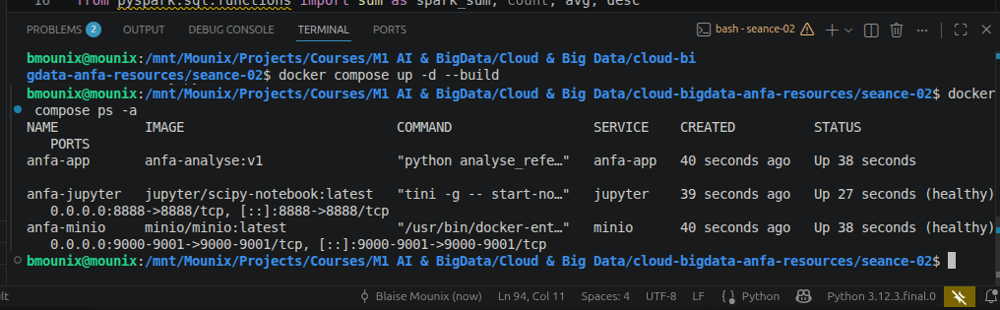
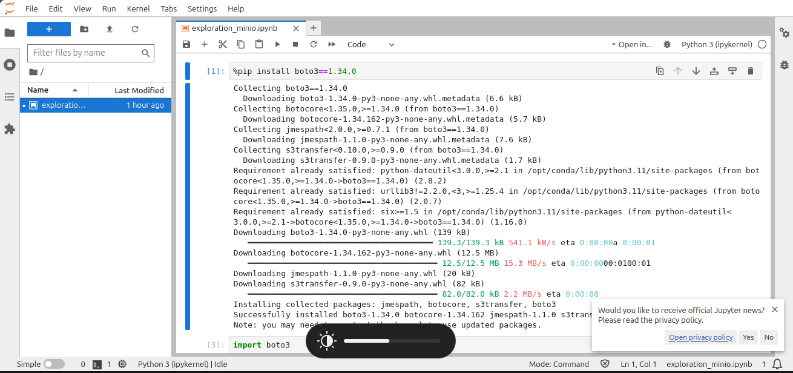
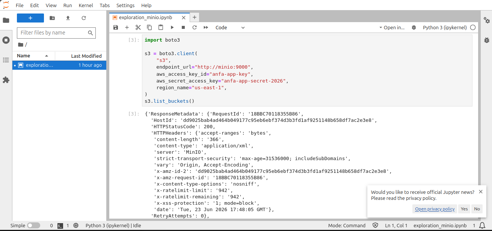
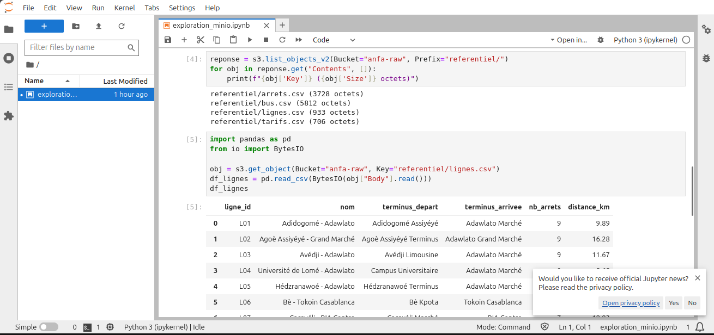
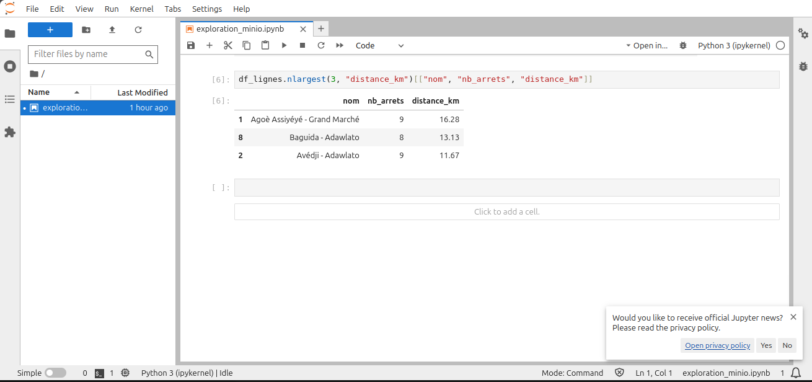

# Rendu - Séance 2

**Nom et prénom :** BLAISE Mouné Tchoubou  
**Identifiant GitHub :** Mounix756  
**Date de soumission :** 23/06/2026

---

## Résumé de la séance

Dans cette séance, j'ai écrit mon premier Dockerfile pour conteneuriser un script PySpark qui analyse le référentiel d'Anfa. J'ai construit l'image, observé le mécanisme de cache de Docker, puis orchestré un stack à 3 services (MinIO + Jupyter + mon image custom) avec Docker Compose. Enfin, j'ai exploré les données du bucket `anfa-raw` depuis un notebook Jupyter via boto3 et pandas.

Ce que j'ai surtout retenu : l'ordre des instructions dans un Dockerfile n'est pas anodin. Mettre `COPY requirements.txt` et `RUN pip install` avant `COPY . .` protège l'installation des dépendances du cache — si on inverse, pip se relance à chaque modification du code, ce qui est très coûteux avec PySpark (300+ Mo).

---

## Étapes principales

1. Écriture du `Dockerfile` et construction de l'image `anfa-analyse:v1` — taille observée : **1.17 GB** (Java + PySpark embarqués).
2. Ajout du `.dockerignore` et observation du cache Docker : rebuild sans modification → toutes les étapes `CACHED`. Modification du code seul → seul le `COPY . .` est refait, le `pip install` est réutilisé.
3. Écriture du `docker-compose.yml` orchestrant MinIO (stockage S3), Jupyter (exploration) et anfa-app (analyse PySpark).
4. Lancement de la stack avec `docker compose up -d --build` et vérification via `docker compose ps -a`.
5. Création du notebook `exploration_minio.ipynb` dans Jupyter : connexion à MinIO via boto3, listing des objets, lecture du CSV `lignes.csv` avec pandas, analyse exploratoire.
6. Build du `Dockerfile.multistage` pour comparer les tailles — image v2 : **1.17 GB**, aucun gain par rapport à v1 car Java reste obligatoire dans les deux cas.

---

## Captures d'écran

### docker compose ps -a


### Notebook Jupyter





---

## Bonus multi-stage

| Image | Taille |
|---|---|
| `anfa-analyse:v1` | 1.17 GB |
| `anfa-analyse:v2-multistage` | 1.17 GB |

Pas de gain observé. Le prof l'avait anticipé : pour PySpark, Java est obligatoire dans les deux étapes, donc le multi-stage ne réduit pas significativement la taille. Le principe reste utile pour des applications compilées (Go, Rust) où on peut passer de 1 Go à quelques Mo.

---

## Difficultés rencontrées

1. **Fichier Dockerfile avec un espace dans le nom** — lors de la création via `cat >`, un espace s'est glissé devant le nom (`' Dockerfile'`). Résolu avec `mv ' Dockerfile' Dockerfile`.

2. **Chemin `/mnt/` non partagé avec Docker Desktop** — au moment de `docker run` avec le bind mount, Docker a refusé le chemin. Résolu en ajoutant `/mnt` dans Docker Desktop → Settings → Resources → File Sharing.

3. **Clés applicatives MinIO perdues après `docker compose down`** — le volume `minio-data` persiste mais les clés applicatives (`anfa-app-key`) créées via `mc` sont liées à la configuration interne de MinIO. Après un nouveau conteneur MinIO, il faut les recréer avec `mc admin user svcacct add` et re-uploader les CSV via le script de la séance 1.

4. **Conflit de nom de conteneur** — `anfa-minio` de la séance 1 tournait encore au moment de `docker compose up`. Résolu avec `docker stop anfa-minio && docker rm anfa-minio`.

---

## Exercices d'application

---

### Exercice 1 : QCM conceptuel

#### 1.1 — Virtualisation vs conteneurisation

**Réponse : C. Un conteneur partage le noyau de la machine hôte.**

Contrairement à une VM qui embarque son propre noyau, un conteneur Docker utilise directement le noyau Linux de l'hôte — c'est ce qui le rend léger et rapide à démarrer.

---

#### 1.2 — Image vs conteneur Docker

**Réponse : B. L'image est un modèle figé en lecture seule ; le conteneur est une instance en cours d'exécution.**

L'image c'est le moule, le conteneur c'est ce qu'on coule dedans — on peut lancer plusieurs conteneurs à partir d'une même image, comme on instancie plusieurs objets depuis une classe.

---

#### 1.3 — Isolation des processus

**Réponse : B. Les namespaces**

Les namespaces Linux permettent d'isoler ce que chaque processus peut voir : réseau, système de fichiers, PID, utilisateurs — chaque conteneur a sa propre vue du système sans voir les autres.

---

#### 1.4 — Limitation des ressources

**Réponse : A. Les cgroups**

Les cgroups (control groups) permettent de définir des quotas de CPU, mémoire, I/O pour un groupe de processus — Docker s'en sert pour empêcher un conteneur de monopoliser les ressources de l'hôte.

---

#### 1.5 — Docker sous macOS

**Réponse : B. Dans une machine virtuelle Linux invisible gérée par Docker Desktop.**

macOS n'a pas de noyau Linux, donc Docker Desktop crée automatiquement une VM Linux légère (basée sur HyperKit ou Apple Virtualization) dans laquelle les conteneurs s'exécutent réellement.

---

#### 1.6 — DotCloud

**Réponse : B. La société d'origine qui a créé et open-sourcé Docker en 2013.**

DotCloud était une plateforme PaaS qui a développé Docker en interne pour ses propres besoins, puis l'a rendu open source en 2013 — la technologie a eu tellement de succès que la société s'est renommée Docker Inc.

---

#### 1.7 — Contribution de Docker par rapport à LXC

**Réponse : C. Docker a apporté un format d'image portable, une CLI simple et un registre public, en s'appuyant sur les mêmes primitives que LXC.**

LXC existait avant Docker et utilisait déjà les namespaces et cgroups. Ce que Docker a apporté c'est l'expérience développeur : une commande simple, des images portables et Docker Hub pour les partager.

---

#### 1.8 — OCI

**Réponse : B. Open Container Initiative — une norme ouverte pour les images et le runtime**

L'OCI définit des standards ouverts pour le format des images et le runtime des conteneurs, ce qui permet à différents outils (Docker, Podman, containerd) d'être interopérables.

---

### Exercice 2 : Lecture et analyse d'un Dockerfile

```dockerfile
FROM python:3.11
WORKDIR /application
COPY . /application
RUN pip install -r requirements.txt
EXPOSE 5000
CMD ["python", "main.py"]
```

#### 2.1 — Explication de chaque instruction

| Instruction | Ce qu'elle fait |
|---|---|
| `FROM python:3.11` | Définit l'image de base : Python 3.11 (image complète, ~1 Go). |
| `WORKDIR /application` | Définit le dossier de travail dans le conteneur — toutes les commandes suivantes s'exécutent depuis ce dossier. |
| `COPY . /application` | Copie tout le contenu du dossier courant (contexte de build) dans `/application` dans le conteneur. |
| `RUN pip install -r requirements.txt` | Installe les dépendances Python listées dans `requirements.txt`. |
| `EXPOSE 5000` | Documente que le conteneur écoute sur le port 5000 (déclaratif seulement, n'ouvre pas le port). |
| `CMD ["python", "main.py"]` | Définit la commande exécutée au démarrage du conteneur. |

---

#### 2.2 — EXPOSE vs -p 5000:5000

`EXPOSE 5000` est purement **documentaire** : il indique aux autres développeurs que l'application écoute sur ce port, mais n'ouvre rien réellement. `-p 5000:5000` dans `docker run` est l'instruction **opérationnelle** qui relie concrètement le port 5000 de la machine hôte au port 5000 du conteneur, rendant l'application accessible depuis l'extérieur.

---

#### 2.3 — Deux problèmes selon les bonnes pratiques

**Problème 1 : Mauvais ordre des instructions (cache non optimisé)**

`COPY . /application` est placé avant `RUN pip install`. Du coup, à chaque modification du code (même une seule ligne), Docker invalide le cache et relance `pip install` entièrement. Avec des dépendances lourdes, c'est très coûteux.

Correction : copier d'abord `requirements.txt` seul, installer les dépendances, puis copier le reste du code.

```dockerfile
COPY requirements.txt .
RUN pip install -r requirements.txt
COPY . .
```

**Problème 2 : Image de base trop lourde**

`python:3.11` est l'image complète qui pèse environ 1 Go. Pour une application Python simple, `python:3.11-slim` suffit et fait 3 à 4 fois moins.

Correction : remplacer `FROM python:3.11` par `FROM python:3.11-slim-bookworm`.

---

#### 2.4 — Version corrigée du Dockerfile

```dockerfile
# Image de base légère
FROM python:3.11-slim-bookworm

# Variables d'environnement recommandées
ENV PYTHONDONTWRITEBYTECODE=1 \
    PYTHONUNBUFFERED=1

WORKDIR /application

# On copie requirements.txt EN PREMIER pour profiter du cache
COPY requirements.txt .
RUN pip install --no-cache-dir -r requirements.txt

# On copie le code ensuite (change souvent, pas le pip install)
COPY . .

# Créer un utilisateur non-root et basculer dessus
RUN adduser --disabled-password --gecos "" appuser
USER appuser

EXPOSE 5000
CMD ["python", "main.py"]
```

---

### Exercice 3 : Diagnostic

#### 3.1 — Le build qui échoue

```
ERROR: Could not open requirements file: [Errno 2] No such file or directory: 'requirements.txt'
```

**a. Cause précise :**

Le `RUN pip install -r requirements.txt` est exécuté avant le `COPY . .`. À ce stade, `requirements.txt` n'a pas encore été copié dans le conteneur — il n'existe donc pas, d'où l'erreur.

**b. Correction du Dockerfile :**

```dockerfile
FROM python:3.11-slim
WORKDIR /app
COPY requirements.txt .          # copier d'abord
RUN pip install -r requirements.txt   # installer ensuite
COPY . .
CMD ["python", "main.py"]
```

**c. Pourquoi ça illustre une mauvaise compréhension de Docker :**

Docker construit l'image couche par couche dans l'ordre des instructions. Le système de fichiers du conteneur est vide au départ — un fichier n'existe dans le conteneur que si une instruction `COPY` ou `ADD` l'y a placé. L'étudiant confond le contexte de build (sa machine locale) avec le système de fichiers du conteneur en cours de construction.

---

#### 3.2 — Le conteneur qui ne voit pas l'autre

**a. Erreur dans le DATABASE_URL :**

L'URL utilise `localhost` comme hôte de la base de données. Depuis le conteneur `api`, `localhost` désigne le conteneur lui-même, pas le conteneur `db`. Les deux services sont sur des conteneurs différents.

**b. Correction :**

```yaml
DATABASE_URL: "postgresql://user:password@db:5432/anfa"
```

Dans un réseau Docker Compose, les conteneurs se joignent par leur **nom de service** — ici `db` — et non par `localhost`. C'est la résolution DNS automatique du réseau Compose.

---

### Exercice 4 : Optimisation d'image

#### a. Quatre problèmes identifiés

**Problème 1 : Image de base trop lourde (`ubuntu:22.04`)**
Ubuntu est une distribution complète avec des centaines d'outils inutiles pour faire tourner un script Python. `python:3.11-slim` ferait la même chose en 10 fois moins.

**Problème 2 : Instructions `RUN apt-get` séparées**
Chaque `RUN` crée une couche Docker distincte. Les caches apt entre les couches gonflent l'image. Il faut tout regrouper en un seul `RUN` et nettoyer le cache dans la même couche.

**Problème 3 : Outils inutiles installés (`git`, `build-essential`, `wget`)**
Pour un script qui télécharge et compresse des fichiers avec `requests`, `git` et `build-essential` ne servent à rien. Chaque paquet inutile ajoute du poids et augmente la surface d'attaque.

**Problème 4 : Exécution en root**
Par défaut, le processus dans le conteneur tourne en `root`. Si l'application est compromise, l'attaquant a les pleins pouvoirs dans le conteneur. Il faut créer un utilisateur dédié.

---

#### b. Version optimisée

```dockerfile
# Image de base légère : Python officiel slim au lieu d'Ubuntu complet
FROM python:3.11-slim-bookworm

ENV PYTHONDONTWRITEBYTECODE=1 \
    PYTHONUNBUFFERED=1

# Un seul RUN pour apt : évite les couches inutiles et nettoie le cache
# On n'installe que curl, le strict nécessaire
RUN apt-get update && \
    apt-get install -y --no-install-recommends curl && \
    rm -rf /var/lib/apt/lists/*

WORKDIR /app

# requirements.txt en premier pour protéger le pip install du cache
COPY requirements.txt .
RUN pip install --no-cache-dir -r requirements.txt

# Code ensuite (change souvent)
COPY . .

# Utilisateur non-root pour limiter les risques
RUN adduser --disabled-password --gecos "" appuser
USER appuser

CMD ["python3", "downloader.py"]
```

---

### Exercice 5 : Mini-cas d'architecture

#### a. Services à conteneuriser

| Service | Rôle |
|---|---|
| `pipeline` | Script Python qui tourne toutes les nuits : lit le FTP, nettoie les données et écrit les résultats dans MinIO. |
| `minio` | Stockage objet S3 compatible qui reçoit les données agrégées et les met à disposition de Jupyter. |
| `jupyter` | Notebook interactif pour que Kossi et Awa explorent les données stockées dans MinIO et créent des graphiques. |

---

#### b. Restart policy pour le script pipeline

**Choix : `no`**

Le script est un job batch qui s'exécute, termine, et doit s'arrêter — ce n'est pas un service permanent. Avec `unless-stopped` ou `always`, Docker redémarrerait le conteneur indéfiniment après chaque exécution, ce qui n'a aucun sens pour un script nocturne. La planification doit être gérée par un outil externe (cron, Airflow) qui déclenche le conteneur au bon moment.

---

#### c. Passer la date au script

**Mécanisme 1 : Variable d'environnement**
```bash
docker run -e DATE_TRAITEMENT=2026-06-23 pipeline
```
Le script lit `os.environ["DATE_TRAITEMENT"]` sans modification structurelle.

**Mécanisme 2 : Argument de commande via `docker run`**
```bash
docker run pipeline python main.py --date 2026-06-23
```
On surcharge le `CMD` du Dockerfile au moment du `docker run`.

**Recommandation : la variable d'environnement.** Elle est plus facile à passer depuis un orchestrateur (Airflow, cron, CI/CD) et ne nécessite aucune modification du `CMD` dans le Dockerfile.

---

#### d. Pourquoi ne pas mettre le script dans le conteneur Jupyter ?

Ce serait mélanger deux responsabilités distinctes dans un seul conteneur, ce qui va à l'encontre du principe d'isolation de Docker. Le script pipeline est un job batch critique qui doit pouvoir être planifié, redémarré et monitoré indépendamment de Jupyter. Si Jupyter tombe ou est redémarré pour une mise à jour, le pipeline ne doit pas être affecté. Avoir des conteneurs séparés permet aussi de dimensionner les ressources différemment : le pipeline peut avoir besoin de plus de mémoire la nuit, Jupyter d'un accès interactif le jour.

---

#### e. Squelette de docker-compose.yml

```yaml
services:

  minio:
    image: minio/minio:latest
    container_name: anfa-minio
    ports:
      - "9000:9000"
      - "9001:9001"
    environment:
      MINIO_ROOT_USER: anfa-admin
      MINIO_ROOT_PASSWORD: anfa-password-2026
    volumes:
      - minio-data:/data
    command: server /data --console-address ":9001"
    healthcheck:
      test: ["CMD", "curl", "-f", "http://localhost:9000/minio/health/live"]
      interval: 10s
      timeout: 5s
      retries: 5

  jupyter:
    image: jupyter/scipy-notebook:latest
    container_name: anfa-jupyter
    ports:
      - "8888:8888"
    environment:
      JUPYTER_TOKEN: anfa-token
    volumes:
      - ./notebooks:/home/jovyan/work
    depends_on:
      minio:
        condition: service_healthy

  pipeline:
    build:
      context: ./pipeline
      dockerfile: Dockerfile
    container_name: anfa-pipeline
    restart: "no"
    environment:
      DATE_TRAITEMENT: ${DATE_TRAITEMENT:-2026-06-23}
      MINIO_ENDPOINT: http://minio:9000
      MINIO_ACCESS_KEY: anfa-app-key
      MINIO_SECRET_KEY: anfa-app-secret-2026
    depends_on:
      minio:
        condition: service_healthy

volumes:
  minio-data:
```
