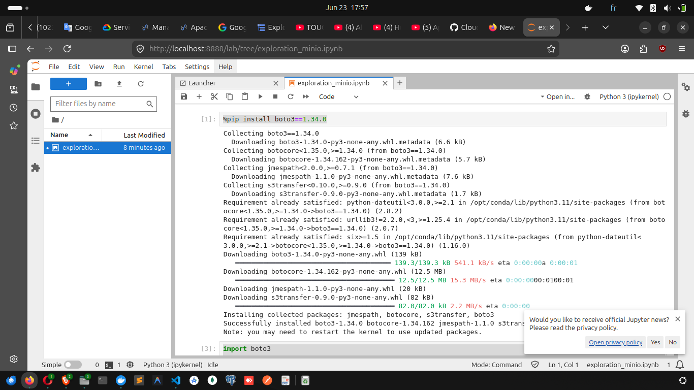

# Rendu - Séance 2

**Nom et prénom :** BLAISE Mouné Tchoubou  
**Identifiant GitHub :** Mounix756  
**Date de soumission :** 23/06/2026

---

## Résumé de la séance

Dans cette séance, j'ai écrit mon premier Dockerfile pour conteneuriser un script PySpark qui analyse le référentiel d'Anfa. J'ai construit l'image, observé le mécanisme de cache de Docker, puis orchestré un stack à 3 services (MinIO + Jupyter + mon image custom) avec Docker Compose. Enfin, j'ai exploré les données du bucket `anfa-raw` depuis un notebook Jupyter via boto3 et pandas.

Ce que j'ai surtout retenu : l'ordre des instructions dans un Dockerfile n'est pas anodin. Mettre `COPY requirements.txt` et `RUN pip install` avant `COPY . .` protège l'installation des dépendances du cache — si on inverse, pip se relance à chaque modification du code, ce qui est très coûteux avec PySpark (300+ Mo).

---

## Étapes principales

1. Écriture du `Dockerfile` et construction de l'image `anfa-analyse:v1` — taille observée : **1.17 GB** (Java + PySpark embarqués).
2. Ajout du `.dockerignore` et observation du cache Docker : rebuild sans modification → toutes les étapes `CACHED`. Modification du code seul → seul le `COPY . .` est refait, le `pip install` est réutilisé.
3. Écriture du `docker-compose.yml` orchestrant MinIO (stockage S3), Jupyter (exploration) et anfa-app (analyse PySpark).
4. Lancement de la stack avec `docker compose up -d --build` et vérification via `docker compose ps -a`.
5. Création du notebook `exploration_minio.ipynb` dans Jupyter : connexion à MinIO via boto3, listing des objets, lecture du CSV `lignes.csv` avec pandas, analyse exploratoire.
6. Build du `Dockerfile.multistage` pour comparer les tailles — image v2 : **1.17 GB**, aucun gain par rapport à v1 car Java reste obligatoire dans les deux cas.

---

## Captures d'écran

### docker compose ps -a

### Notebook Jupyter

---

## Bonus multi-stage

| Image | Taille |
|---|---|
| `anfa-analyse:v1` | 1.17 GB |
| `anfa-analyse:v2-multistage` | 1.17 GB |

Pas de gain observé. Le prof l'avait anticipé : pour PySpark, Java est obligatoire dans les deux étapes, donc le multi-stage ne réduit pas significativement la taille. Le principe reste utile pour des applications compilées (Go, Rust) où on peut passer de 1 Go à quelques Mo.

---

## Difficultés rencontrées

1. **Fichier Dockerfile avec un espace dans le nom** — lors de la création via `cat >`, un espace s'est glissé devant le nom (`' Dockerfile'`). Résolu avec `mv ' Dockerfile' Dockerfile`.

2. **Chemin `/mnt/` non partagé avec Docker Desktop** — au moment de `docker run` avec le bind mount, Docker a refusé le chemin. Résolu en ajoutant `/mnt` dans Docker Desktop → Settings → Resources → File Sharing.

3. **Clés applicatives MinIO perdues après `docker compose down`** — le volume `minio-data` persiste mais les clés applicatives (`anfa-app-key`) créées via `mc` sont liées à la configuration interne de MinIO. Après un nouveau conteneur MinIO, il faut les recréer avec `mc admin user svcacct add` et re-uploader les CSV via le script de la séance 1.

4. **Conflit de nom de conteneur** — `anfa-minio` de la séance 1 tournait encore au moment de `docker compose up`. Résolu avec `docker stop anfa-minio && docker rm anfa-minio`.
