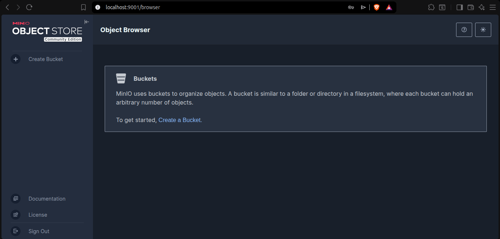
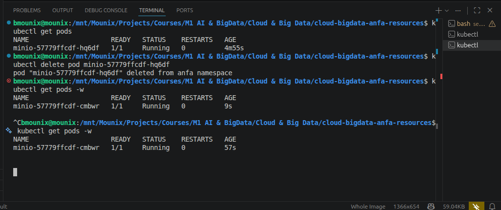
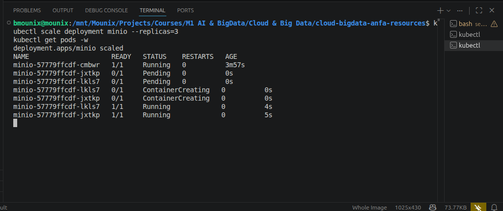

# Rendu Séance 3

**Nom et prénom :** BLAISE Mouné Tchoubou  
**Identifiant GitHub :** Mounix756  
**Date de soumission :** 24/06/2026

---

## Résumé de la séance

Dans cette séance, j'ai installé Kind et kubectl, puis créé un cluster Kubernetes local nommé `anfa` dans des conteneurs Docker. J'ai déployé MinIO sur ce cluster via 3 manifestes YAML (PVC, Deployment, Service), observé le self-healing en supprimant manuellement un pod et en voyant Kubernetes le recréer automatiquement, scalé le Deployment de 1 à 3 replicas en une commande, et activé l'Ingress Controller nginx.

Ce qui m'a le plus marqué : le nœud Kubernetes lui-même est un conteneur Docker. Et quand j'ai supprimé le pod MinIO, il est revenu tout seul en quelques secondes — sans que j'aie rien fait.

---

## Étapes principales

1. Installation de Kind v0.32.0 et kubectl v1.36.2, vérification des versions.
2. Création du cluster `anfa` avec `kind create cluster --name anfa --image kindest/node:v1.35.1`.
3. Exploration du cluster : `kubectl get pods --all-namespaces` pour voir les composants du Control Plane (etcd, API Server, Scheduler, Controller Manager) qui tournent eux-mêmes comme des pods.
4. Création du namespace `anfa` et configuration de kubectl pour l'utiliser par défaut.
5. Déploiement de MinIO via 3 manifestes YAML dans l'ordre : PVC (`minio-pvc`), Deployment (`minio`), Service (`minio` NodePort).
6. Accès à la console MinIO via `kubectl port-forward service/minio 9001:9001`.
7. Observation du self-healing : suppression manuelle du pod, recréation automatique par le Deployment.
8. Scaling de 1 à 3 replicas avec `kubectl scale deployment minio --replicas=3`, puis retour à 1.
9. Activation de l'Ingress Controller nginx et vérification que son pod est en `Running`.

---

## Captures d'écran

### Console MinIO accessible via port-forward


### Self-healing observé


### Scaling à 3 replicas


---

## Difficultés rencontrées

Aucune difficulté majeure. Le PVC est resté en `Pending` jusqu'au démarrage du pod — c'est le comportement normal de Kind qui provisionne le volume à la demande.

---

## Exercices d'application

---

### Exercice 1 : QCM conceptuel

#### 1.1 — Kubernetes et les conteneurs

**Réponse : B. Kubernetes orchestre des conteneurs sur un cluster de machines, en s'appuyant sur un container runtime.**

Kubernetes n'est pas un moteur de conteneurs — il délègue cette partie à containerd, CRI-O ou Docker. Son rôle c'est d'orchestrer : planifier, surveiller, et maintenir l'état souhaité des conteneurs sur un cluster.

---

#### 1.2 — Composant qui stocke l'état du cluster

**Réponse : B. etcd**

etcd est la base de données clé-valeur distribuée du Control Plane — tout l'état du cluster (pods, services, configurations) y est stocké. Si etcd est perdu, le cluster perd sa mémoire.

---

#### 1.3 — Composant qui décide où placer un pod

**Réponse : C. Scheduler**

Le Scheduler surveille les nouveaux pods sans nœud assigné et choisit le nœud le plus adapté en fonction des ressources disponibles, des contraintes et des affinités définies.

---

#### 1.4 — À qui parle kubectl get pods ?

**Réponse : C. À l'API Server, qui est le point d'entrée unique du cluster.**

Toutes les interactions avec Kubernetes passent par l'API Server — kubectl ne parle jamais directement aux pods, à etcd ou au Scheduler. L'API Server est le seul point d'entrée.

---

#### 1.5 — Supprimer un pod géré par un Deployment

**Réponse : B. Le Deployment recrée immédiatement un nouveau pod pour respecter l'état souhaité.**

C'est le self-healing : le Controller Manager détecte que l'état observé (0 pod) ne correspond plus à l'état souhaité (1 replica) et demande la création d'un nouveau pod. On l'a observé concrètement en TP.

---

#### 1.6 — Service accessible depuis l'extérieur sans load balancer cloud

**Réponse : B. NodePort**

NodePort expose le service sur un port fixe de chaque nœud du cluster (entre 30000 et 32767), ce qui permet l'accès depuis l'extérieur sans dépendre d'un load balancer cloud. C'est ce qu'on a utilisé en TP pour MinIO.

---

#### 1.7 — kubectl scale deployment minio --replicas=5

**Réponse : B. Elle modifie l'état souhaité du Deployment à 5 replicas ; Kubernetes converge vers ce nombre.**

`kubectl scale` ne crée pas directement des pods — il met à jour le champ `replicas` du Deployment. C'est ensuite le Controller Manager qui détecte l'écart et crée les pods manquants pour atteindre l'état souhaité.

---

#### 1.8 — Namespace Kubernetes

**Réponse : B. À isoler logiquement les ressources (séparation par équipe, environnement, ou application).**

Un namespace est une partition logique du cluster — on peut avoir un namespace `dev`, un `prod`, un `anfa`, chacun avec ses propres ressources isolées. C'est ce qu'on a fait en créant le namespace `anfa` pour y déployer MinIO.

---

#### 1.9 — Les nœuds Kind

**Réponse : B. Des conteneurs Docker.**

C'est ce qu'on a observé avec `docker ps` après `kind create cluster` : le nœud `anfa-control-plane` est un conteneur Docker basé sur l'image `kindest/node`. Kubernetes orchestre des conteneurs, et lui-même tourne dans des conteneurs.

---

### Exercice 2 : Lecture et interprétation d'un manifeste

```yaml
apiVersion: apps/v1
kind: Deployment
metadata:
  name: anfa-api
  namespace: anfa
spec:
  replicas: 2
  selector:
    matchLabels:
      app: anfa-api
  template:
    metadata:
      labels:
        app: anfa-api
    spec:
      containers:
      - name: api
        image: anfa-api:v1.2
        ports:
        - containerPort: 8000
        env:
        - name: MINIO_ENDPOINT
          value: "http://minio:9000"
        - name: LOG_LEVEL
          value: "INFO"
```

#### 2.1 — Rôle de selector.matchLabels et son lien avec template.metadata.labels

`selector.matchLabels` définit les labels que le Deployment utilise pour identifier les pods qu'il gère. `template.metadata.labels` définit les labels appliqués aux pods créés. Les deux doivent correspondre exactement : si ce n'est pas le cas, le Deployment ne reconnaît pas ses propres pods et Kubernetes rejette le manifeste.

---

#### 2.2 — Nombre de pods et comportement en cas de mort

Ce Deployment crée **2 pods**. Si l'un meurt, le Controller Manager détecte que l'état observé (1 pod) ne correspond pas à l'état souhaité (2 replicas) et recrée automatiquement un nouveau pod — c'est le self-healing qu'on a observé en TP.

---

#### 2.3 — Pourquoi http://minio:9000 fonctionne

`minio` est le nom du Service Kubernetes qui expose MinIO. Dans un cluster Kubernetes, CoreDNS assure la résolution DNS automatique des services — chaque Service est accessible par son nom dans le même namespace. Les pods n'ont pas besoin de connaître l'adresse IP, qui peut changer ; le nom de service est stable.

---

#### 2.4 — Conséquence de l'absence de Service

Sans Service, les pods de l'API sont inaccessibles depuis l'extérieur du cluster et même depuis les autres pods (sauf en connaissant l'IP du pod, qui change à chaque recréation). L'API ne peut pas recevoir de requêtes — il faut définir un Service ClusterIP au minimum pour l'exposer aux autres composants du cluster.

---

#### 2.5 — Manifeste Service pour exposer le Deployment

```yaml
apiVersion: v1
kind: Service
metadata:
  name: anfa-api
  namespace: anfa
spec:
  type: ClusterIP
  selector:
    app: anfa-api
  ports:
    - port: 80
      targetPort: 8000
```

Ce Service de type `ClusterIP` expose l'API à l'intérieur du cluster sur le port 80, en redirigeant vers le port 8000 des pods ciblés par le label `app: anfa-api`.

---

### Exercice 3 : Diagnostic

#### 3.1 — Le pod qui ne démarre pas

**a. Que signifie ImagePullBackOff ?**

Kubernetes n'a pas réussi à télécharger l'image du conteneur depuis le registre. Après plusieurs tentatives échouées, il entre en `BackOff` — il attend de plus en plus longtemps entre chaque nouvel essai pour ne pas surcharger le registre.

**b. Cause probable ici :**

L'image `minio/miniooo:latest` contient une faute de frappe (`miniooo` au lieu de `minio`). Cette image n'existe pas sur Docker Hub, d'où l'échec du pull.

**c. Commande pour plus de détails :**

```bash
kubectl describe pod minio-7d9f8b6c5-x2k9p
```

La section `Events` en bas de la sortie indique précisément l'erreur : `Failed to pull image "minio/miniooo:latest": not found`.

---

#### 3.2 — Le PVC qui ne se lie pas

**a. Que signifie Pending pour un PVC ?**

Le PVC est en attente : Kubernetes n'a pas encore trouvé de PersistentVolume disponible qui satisfait la demande (taille, mode d'accès, StorageClass).

**b. Cause probable dans un cluster Kind local :**

Le PVC demande **500 Gi** de stockage. Le provisioner local de Kind crée des volumes à la demande, mais la machine hôte n'a probablement pas 500 Go disponibles. La demande est trop grande pour l'environnement local.

**c. Commande de diagnostic :**

```bash
kubectl describe pvc data-pvc
```

La section `Events` indiquera si c'est un problème de capacité ou de StorageClass.

---

#### 3.3 — Le port-forward qui échoue

**a. Pourquoi cette erreur ?**

`kubectl port-forward` a besoin que le pod cible soit en état `Running` pour établir un tunnel. Si le pod est en `Pending`, il n'est pas encore démarré et aucune connexion n'est possible.

**b. Commande pour comprendre le Pending :**

```bash
kubectl describe pod <nom-du-pod>
```

Ou pour voir tous les pods :
```bash
kubectl get pods -n <namespace>
```

**c. Ordre logique avant un port-forward :**

1. Vérifier que le PVC est en `Bound`
2. Vérifier que le Deployment est créé et que le pod est en `Running`
3. Vérifier que le Service existe
4. Lancer `kubectl port-forward` seulement une fois le pod `Running`

---

### Exercice 4 : De Docker Compose à Kubernetes

#### 4.1 — Combien de manifestes Kubernetes ?

Pour reproduire le service MinIO du docker-compose.yml, il faut **3 manifestes** :

| Manifeste | Rôle |
|---|---|
| `minio-pvc.yaml` (PersistentVolumeClaim) | Équivalent du volume nommé `minio-data` — demande du stockage persistant au cluster. |
| `minio-deployment.yaml` (Deployment) | Équivalent de la définition du service dans Compose — décrit le pod MinIO, son image, ses variables d'environnement et son volume. |
| `minio-service.yaml` (Service) | Équivalent des `ports:` dans Compose — expose MinIO sur le réseau du cluster et depuis l'extérieur. |

---

#### 4.2 — Volume Docker nommé vs PersistentVolumeClaim

En Docker Compose, `minio-data:` est un volume géré localement par Docker sur la machine hôte — simple et immédiat, mais lié à une seule machine. En Kubernetes, un PVC est une **demande abstraite de stockage** : le cluster trouve lui-même un PersistentVolume qui satisfait la demande (taille, mode d'accès), peu importe où il se trouve physiquement. Cela permet de changer de backend de stockage (disque local, NFS, cloud) sans modifier le manifeste de l'application.

---

#### 4.3 — localhost avec Compose vs port-forward avec Kind

Avec Docker Compose, les ports sont directement mappés sur l'hôte via `-p`, donc `localhost:9001` fonctionne immédiatement. Avec Kind, les nœuds sont des conteneurs Docker isolés — le NodePort est exposé sur le nœud, pas sur l'hôte. `kubectl port-forward` crée un tunnel temporaire entre l'hôte et le service. Pour un accès direct sur un port de l'hôte comme avec Compose, il faudrait configurer Kind avec `extraPortMappings` dans son fichier de configuration au moment de la création du cluster.

---

#### 4.4 — Deux apports de Kubernetes observés en TP

1. **Self-healing automatique** : quand on a supprimé le pod MinIO manuellement, Kubernetes l'a recréé en quelques secondes sans intervention. Avec Docker Compose, le conteneur aurait simplement disparu.

2. **Scaling en une commande** : `kubectl scale deployment minio --replicas=3` a créé 2 pods supplémentaires instantanément. Avec Docker Compose, il faudrait modifier le fichier YAML et relancer, sans gestion automatique de la répartition.

---

### Exercice 5 : Mini-cas d'architecture

#### 5.1 — Type d'objet Kubernetes pour chaque composant

| Composant | Objet Kubernetes | Justification |
|---|---|---|
| `pipeline-anfa` | **CronJob** | C'est une tâche planifiée qui tourne chaque nuit à 2h — exactement le cas d'usage du CronJob, qui déclenche un Job selon une expression cron. |
| `anfa-api` | **Deployment** | L'API doit être toujours disponible avec plusieurs replicas — le Deployment maintient le nombre souhaité de pods en permanence et gère les rolling updates. |
| `anfa-dashboard` | **Deployment** | Le dashboard est une application web avec état standard, consultée en journée — un Deployment avec 1-2 replicas suffit pour une disponibilité standard. |

---

#### 5.2 — Paramètres HPA pour anfa-api

```yaml
minReplicas: 2
maxReplicas: 10
métrique cible: CPU à 60%
```

L'API reçoit 50 req/s aux heures de pointe et 5 req/s le reste du temps — un facteur 10 de variation. Avec `minReplicas: 2` on garantit la haute disponibilité même en période creuse (pas de single point of failure). `maxReplicas: 10` permet d'absorber les pics. Le seuil CPU à 60% laisse une marge avant saturation pour que le scaling ait le temps de s'enclencher.

---

#### 5.3 — Type de Service pour anfa-api

**LoadBalancer**

L'API expose des données aux applications mobiles des conducteurs — c'est un service public qui reçoit du trafic externe. Sur un cluster cloud managé, `LoadBalancer` provisionne automatiquement un load balancer cloud avec une IP publique stable, ce qui est la solution la plus adaptée pour exposer une API en production.

---

#### 5.4 — Comment Kubernetes gère les mises à jour sans coupure

Kubernetes utilise par défaut une stratégie de **rolling update** : il remplace les pods un par un (ou par petits groupes) plutôt que de tous les arrêter d'un coup. Pendant la mise à jour, les anciens pods continuent de recevoir du trafic pendant que les nouveaux démarrent. Un nouveau pod n'est considéré prêt que quand sa probe de readiness passe — seulement à ce moment l'ancien pod est arrêté. Si le nouveau pod échoue, Kubernetes arrête le rollout et les anciens pods restent en place, garantissant la continuité de service.

---

#### 5.5 — Squelette de manifeste pour anfa-api

```yaml
apiVersion: apps/v1
kind: Deployment
metadata:
  name: anfa-api
  namespace: anfa
spec:
  replicas: 3
  selector:
    matchLabels:
      app: anfa-api
  template:
    metadata:
      labels:
        app: anfa-api
    spec:
      containers:
      - name: api
        image: anfa/api:v1
        ports:
        - containerPort: 8000
        env:
        - name: MINIO_ENDPOINT
          value: "http://minio:9000"
        resources:
          requests:
            cpu: "100m"
            memory: "128Mi"
          limits:
            cpu: "500m"
            memory: "512Mi"
