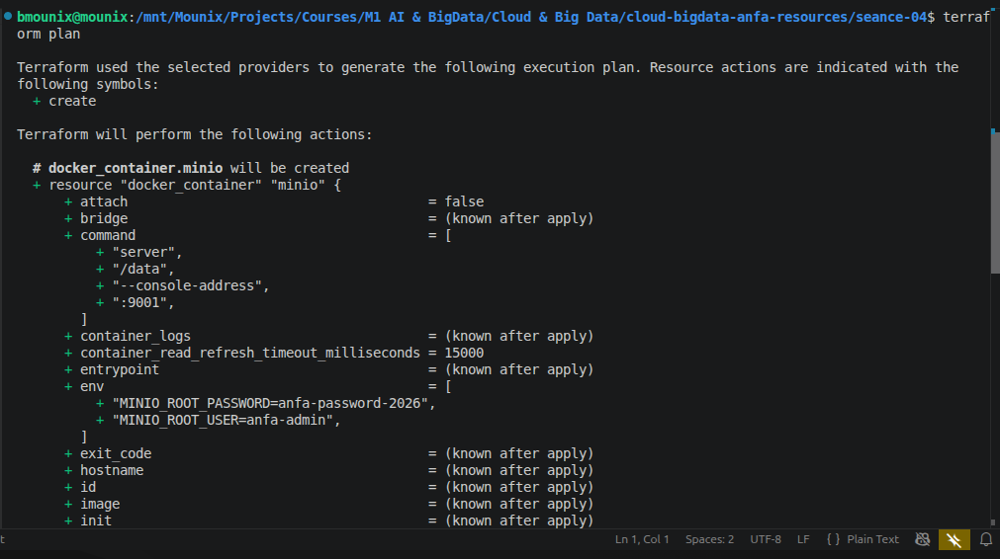
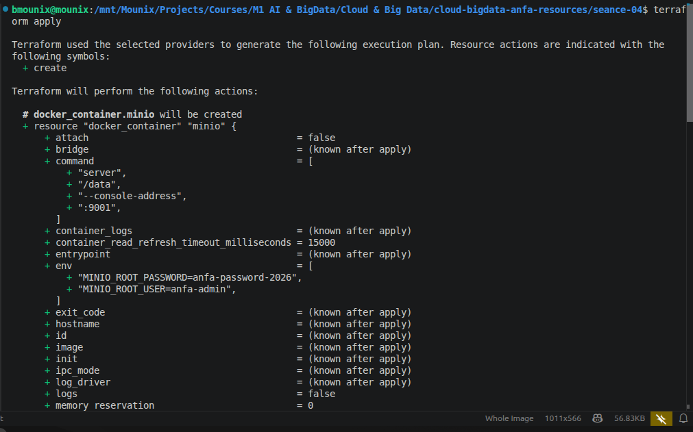
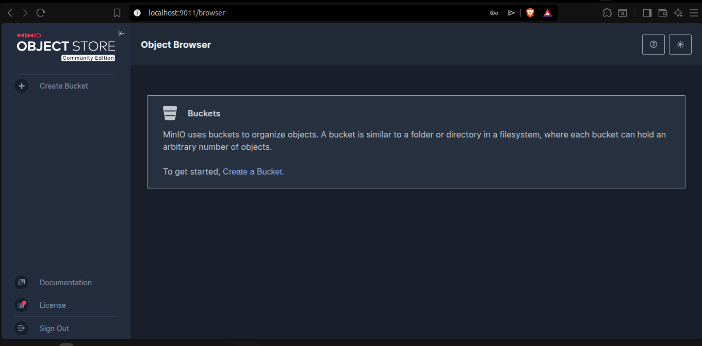
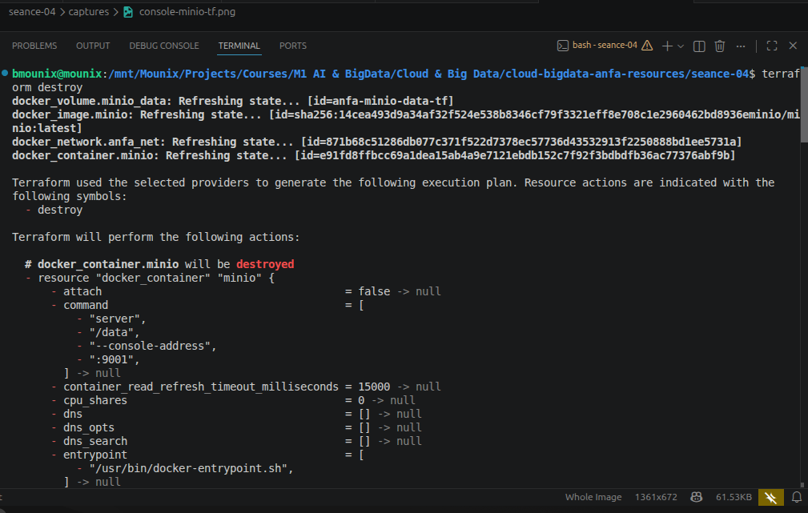

# Rendu — Séance 4

**Nom et prénom :** BLAISE Mouné Tchoubou  
**Identifiant GitHub :** Mounix756  
**Date de soumission :** 25/06/2026

---

## Résumé de la séance

Dans cette séance, j'ai installé Terraform et découvert l'Infrastructure as Code en HCL. J'ai décrit en code une infrastructure Docker complète (réseau, volume, image, conteneur MinIO), maîtrisé le workflow `init → plan → apply → destroy`, compris le rôle du state et pourquoi on ne le commit jamais, et refactorisé le code avec des variables pour le rendre propre et réutilisable.

Ce qui m'a le plus frappé : avec `terraform destroy`, trois ressources (conteneur, réseau, volume) sont supprimées proprement dans le bon ordre en une seule commande — Terraform calcule lui-même l'ordre à partir des dépendances entre ressources.

---

## Étapes principales

1. Installation de Terraform v1.15.7 et vérification avec `terraform version`.
2. Écriture du premier `main.tf` minimal (image + conteneur MinIO) et initialisation avec `terraform init` — téléchargement du provider `kreuzwerker/docker v3.9.0`.
3. Prévisualisation avec `terraform plan` : lecture du plan (`+` = créer, `~` = modifier, `-` = supprimer).
4. Application avec `terraform apply` : 2 ressources créées, console MinIO accessible sur `http://localhost:9011`.
5. Observation du fichier `terraform.tfstate` : contient l'état complet de l'infrastructure, y compris les secrets en clair.
6. Mise en place du `.gitignore` Terraform pour exclure le state et les `.tfvars`.
7. Mise à jour vers la stack complète (`main.tf` avec réseau + volume + conteneur) : Terraform a détecté les changements et recréé le conteneur sans toucher au réseau ni au volume nouvellement créés.
8. Création de `variables.tf` et `terraform.tfvars` : le mot de passe sort du code, le plan affiche `No changes` — l'idempotence est confirmée.
9. Destruction propre avec `terraform destroy` : 4 ressources supprimées dans le bon ordre automatiquement.

---

## Captures d'écran

### terraform plan (création initiale)


### terraform apply réussi


### Console MinIO créée par Terraform


### terraform destroy


---

## Difficultés rencontrées

Aucune difficulté majeure. Lors du passage de `main.tf` minimal à la version stack complète, Terraform a recréé le conteneur (à cause de l'ajout du volume et du réseau qui `force replacement`) — c'est le comportement attendu et documenté dans le TP.

---

## Exercices d'application

---

### Exercice 1 : QCM conceptuel

#### 1.1 — Affirmation fausse sur l'IaC

**Réponse : B. L'IaC remplace totalement la nécessité de comprendre l'infrastructure sous-jacente.**

C'est faux — l'IaC automatise la gestion de l'infrastructure, mais comprendre ce qu'on décrit (réseau, volumes, conteneurs, ressources cloud) reste indispensable pour écrire du code correct et diagnostiquer les erreurs.

---

#### 1.2 — Déclaratif vs impératif

**Réponse : B. Le déclaratif décrit l'état souhaité ; l'impératif décrit la séquence d'actions à effectuer.**

Avec Terraform (déclaratif), on dit "je veux un conteneur MinIO avec ces paramètres" — c'est Terraform qui calcule les actions nécessaires. Avec un script shell (impératif), on écrit `docker run ...`, `docker network create ...` dans l'ordre : c'est nous qui gérons la séquence.

---

#### 1.3 — Idempotence

**Réponse : B. Elle produit le même résultat quel que soit le nombre de fois où elle est appliquée.**

On l'a observé en TP : après un premier `terraform apply`, relancer `terraform apply` sans modification affiche `No changes` — l'infrastructure est déjà dans l'état souhaité, Terraform ne fait rien.

---

#### 1.4 — Rôle d'un provider

**Réponse : B. À fournir un plugin qui sait communiquer avec une API spécifique.**

Le provider `kreuzwerker/docker` qu'on a utilisé sait parler à l'API Docker pour créer des conteneurs, réseaux et volumes. Sans provider, Terraform ne sait pas comment interagir avec une infrastructure spécifique.

---

#### 1.5 — terraform apply deux fois de suite

**Réponse : B. Terraform compare le state au code, ne voit aucun écart, et n'effectue aucune action.**

C'est l'idempotence de Terraform. On l'a confirmé après le passage aux variables : `terraform plan` affichait `No changes. Your infrastructure matches the configuration.`

---

#### 1.6 — Rôle de terraform.tfstate

**Réponse : C. Mémoriser ce que Terraform a créé pour pouvoir suivre les changements incrémentaux.**

Le state est la mémoire de Terraform : il contient l'état réel de l'infrastructure telle que Terraform la connaît. C'est grâce à lui que Terraform peut calculer le diff entre ce qui existe et ce qui est demandé.

---

#### 1.7 — Pourquoi ne pas committer terraform.tfstate

**Réponse : B. Parce qu'il peut contenir des secrets en clair et peut être corrompu par des commits concurrents.**

On l'a vu en TP : le mot de passe `anfa-password-2026` apparaît en clair dans le fichier `terraform.tfstate`. Le pousser sur GitHub exposerait les secrets à quiconque a accès au dépôt.

---

#### 1.8 — Commande pour vérifier avant apply

**Réponse : C. terraform plan**

`terraform plan` affiche exactement ce que Terraform compte faire sans rien modifier. C'est le réflexe fondamental : on lit toujours le plan avant d'appliquer.

---

#### 1.9 — OpenTofu

**Réponse : B. Un fork open source de Terraform créé après le changement de licence de HashiCorp en 2023.**

En 2023, HashiCorp a changé la licence de Terraform de MPL (open source) vers BSL (Business Source License), ce qui a poussé la communauté à créer OpenTofu, un fork 100% open source compatible avec Terraform.

---

#### 1.10 — Terraform vs Ansible

**Réponse : B. Non, Terraform provisionne l'infrastructure, Ansible configure des machines existantes — ils sont complémentaires.**

Terraform crée les ressources (VM, réseau, conteneurs), Ansible configure ce qui tourne dessus (installe des packages, déploie des fichiers de config). En pratique, on utilise souvent les deux ensemble dans un pipeline DevOps.

---

### Exercice 2 : Lecture et interprétation d'un fichier Terraform

#### 2.1 — Les 4 ressources

| Ressource | Ce qu'elle fait |
|---|---|
| `docker_network.back` | Crée un réseau Docker nommé `anfa-backend` pour que les conteneurs puissent communiquer entre eux. |
| `docker_volume.data` | Crée un volume Docker nommé `postgres-data` pour persister les données de PostgreSQL. |
| `docker_image.postgres` | Télécharge l'image `postgres:15` depuis Docker Hub et la rend disponible localement. |
| `docker_container.db` | Lance un conteneur PostgreSQL nommé `anfa-postgres`, configuré avec la base `anfa`, branché sur le volume et le réseau. |

---

#### 2.2 — Référence docker_image.postgres.image_id

`docker_image.postgres.image_id` est une **référence inter-ressources** : Terraform récupère l'ID SHA256 réel de l'image après l'avoir téléchargée, plutôt que d'utiliser le tag `postgres:15` qui peut pointer vers des versions différentes selon le moment. Cela garantit que le conteneur utilise exactement la même image que celle déclarée, et crée une dépendance implicite : Terraform sait qu'il doit créer l'image avant le conteneur.

---

#### 2.3 — Ordre de création des ressources

Terraform analyse les dépendances entre ressources et construit un graphe :

1. `docker_network.back` et `docker_volume.data` et `docker_image.postgres` — aucune dépendance entre eux, créés en parallèle.
2. `docker_container.db` — en dernier, car il référence les trois ressources précédentes.

Terraform ne suit pas l'ordre du fichier — il suit le graphe de dépendances.

---

#### 2.4 — Problème de sécurité

Le mot de passe `POSTGRES_PASSWORD=secret123` est écrit **en clair dans le code** qui sera versionné dans Git. Correction :

```hcl
# variables.tf
variable "postgres_password" {
  description = "Mot de passe PostgreSQL"
  type        = string
  sensitive   = true
}

# main.tf
env = [
  "POSTGRES_DB=anfa",
  "POSTGRES_USER=anfa_user",
  "POSTGRES_PASSWORD=${var.postgres_password}",
]
```

```hcl
# terraform.tfvars (dans .gitignore)
postgres_password = "secret123"
```

---

#### 2.5 — Comportement après destroy + modification du port

Terraform va **recréer le conteneur** avec le nouveau port `5433`. Les variables d'environnement d'un conteneur Docker ne sont pas modifiables à chaud — tout changement de configuration qui affecte le conteneur nécessite sa suppression et recréation. Le volume `postgres-data` est une ressource séparée non détruite par `terraform destroy` du conteneur seul — les données PostgreSQL sont donc **conservées** si le volume existe toujours.

---

### Exercice 3 : Diagnostic

#### 3.1 — Dépendance circulaire

**a. Signification de l'erreur :**

Terraform a détecté un cycle dans le graphe de dépendances : `container-a` dépend de `container-b` (via `${docker_container.b.name}`), et `container-b` dépend de `container-a` (via `${docker_container.a.name}`). Impossible de déterminer lequel créer en premier.

**b. Pourquoi Terraform refuse :**

Terraform construit un graphe orienté acyclique (DAG) pour déterminer l'ordre de création. Un cycle rend ce graphe impossible à résoudre — il n'existe pas d'ordre de création valide.

**c. Solution :**

Briser la dépendance circulaire. Par exemple, passer le nom de `b` à `a` via une variable plutôt qu'une référence directe :

```hcl
resource "docker_container" "b" {
  name  = "container-b"
  image = "alpine"
}

resource "docker_container" "a" {
  name  = "container-a"
  image = "alpine"
  env   = ["LINKED_TO=${docker_container.b.name}"]
}
```

`a` dépend de `b`, mais `b` ne dépend plus de `a` — le cycle est brisé.

---

#### 3.2 — Le plan qui veut tout recréer

**a. Pourquoi -/+ au lieu de ~ ?**

Les variables d'environnement d'un conteneur Docker ne peuvent pas être modifiées à chaud — Docker ne permet pas de changer l'`env` d'un conteneur existant. Terraform doit donc le détruire et le recréer pour appliquer le changement. C'est une contrainte du provider Docker, pas de Terraform.

**b. Les données du volume sont-elles perdues ?**

Non. Le volume est une ressource Terraform **séparée** du conteneur. Quand Terraform recrée le conteneur, il supprime et recrée uniquement le conteneur — le volume `docker_volume` persiste. Le nouveau conteneur monte le même volume avec les mêmes données.

**c. Impact opérationnel en production :**

Cette recréation n'est pas gratuite : elle entraîne une **interruption de service** pendant le temps de destruction et recréation du conteneur (quelques secondes à quelques minutes). En production, MinIO serait inaccessible pendant cette fenêtre. Pour minimiser l'impact, il faudrait planifier une maintenance ou utiliser un déploiement avec plusieurs réplicas pour maintenir la disponibilité.

---

#### 3.3 — Le state corrompu

**a. Problème de sécurité immédiat :**

Le fichier `terraform.tfstate` contient les secrets en clair (mots de passe, clés API). En le poussant sur GitHub, ces secrets sont exposés à tous les collaborateurs ayant accès au dépôt, et potentiellement à toute personne si le dépôt est public — même après suppression du fichier, il reste dans l'historique Git.

**b. Risque technique pour Awa :**

Si Awa applique Terraform avec le state récupéré depuis GitHub, elle va tenter de gérer des ressources qui tournent peut-être sur la machine d'un autre collègue. Elle risque de modifier ou détruire des ressources qu'elle ne devrait pas toucher, ou de créer des doublons si le state ne correspond pas à sa propre infrastructure.

**c. Solution pérenne :**

Utiliser un **remote backend** pour stocker le state : Terraform Cloud, un bucket S3 avec verrouillage DynamoDB, ou GitLab-managed Terraform state. Le state est ainsi partagé de façon sécurisée, chiffré, avec un mécanisme de verrou qui empêche deux personnes d'appliquer simultanément.

---

### Exercice 4 : Adaptation Compose → Terraform

```hcl
terraform {
  required_providers {
    docker = {
      source  = "kreuzwerker/docker"
      version = "~> 3.0"
    }
  }
}

provider "docker" {}

# Réseau partagé (équivalent du réseau implicite Compose)
resource "docker_network" "anfa_net" {
  name = "anfa-network"
}

# Volume pour persister les données MinIO
resource "docker_volume" "minio_data" {
  name = "minio-data"
}

# Images
resource "docker_image" "minio" {
  name = "minio/minio:latest"
}

resource "docker_image" "jupyter" {
  name = "jupyter/scipy-notebook:latest"
}

# Conteneur MinIO
resource "docker_container" "minio" {
  name    = "anfa-minio"
  image   = docker_image.minio.image_id
  command = ["server", "/data", "--console-address", ":9001"]
  restart = "unless-stopped"

  ports {
    internal = 9000
    external = 9000
  }
  ports {
    internal = 9001
    external = 9001
  }

  env = [
    "MINIO_ROOT_USER=anfa-admin",
    "MINIO_ROOT_PASSWORD=${var.minio_root_password}",
  ]

  volumes {
    volume_name    = docker_volume.minio_data.name
    container_path = "/data"
  }

  networks_advanced {
    name = docker_network.anfa_net.name
  }

  lifecycle {
    ignore_changes = [log_opts]
  }
}

# Conteneur Jupyter
# La référence à docker_network.anfa_net crée une dépendance implicite :
# Terraform créera le réseau (et donc MinIO) avant Jupyter.
resource "docker_container" "jupyter" {
  name    = "anfa-jupyter"
  image   = docker_image.jupyter.image_id
  restart = "unless-stopped"

  ports {
    internal = 8888
    external = 8888
  }

  env = [
    "JUPYTER_TOKEN=anfa-token",
  ]

  networks_advanced {
    name = docker_network.anfa_net.name
  }

  lifecycle {
    ignore_changes = [log_opts]
  }
}

# Variable pour le mot de passe (pas en clair dans le code)
variable "minio_root_password" {
  description = "Mot de passe administrateur MinIO"
  type        = string
  sensitive   = true
}
```

---

### Exercice 5 : Mini-cas d'architecture

#### 5.1 — Types de ressources Terraform prévues

1. **Un bucket de stockage objet** (équivalent S3 chez OVHcloud) pour stocker les CSV du référentiel et les logs GPS bruts.
2. **Un cluster Kubernetes managé** (OVHcloud Managed Kubernetes) pour héberger les workloads conteneurisés avec élasticité.
3. **Un réseau privé** (vRack OVHcloud) pour isoler les communications internes entre les services.
4. **Des nœuds de calcul autoscalables** (node pools Kubernetes) pour les traitements Spark aux heures de pointe.
5. **Un load balancer** pour exposer le dashboard Grafana publiquement avec une IP stable.
6. **Des règles de firewall** pour sécuriser l'accès aux ressources sensibles.

---

#### 5.2 — Un gros fichier vs plusieurs fichiers

**Recommandation : B — plusieurs fichiers séparés.**

Un fichier de 800 lignes devient rapidement illisible et difficile à maintenir : trouver une ressource précise, comprendre les dépendances, et travailler en équipe sans conflits Git devient cauchemardesque. Séparer par domaine (`network.tf`, `storage.tf`, `compute.tf`, `monitoring.tf`) rend le code lisible, facilite les revues de code ciblées, et permet à plusieurs personnes de travailler sur des fichiers différents sans se marcher dessus. Terraform fusionne tous les fichiers `.tf` d'un dossier automatiquement — la séparation est purement organisationnelle.

---

#### 5.3 — Deux mécanismes pour gérer dev et prod

1. **Fichiers `.tfvars` séparés** : `terraform.dev.tfvars` et `terraform.prod.tfvars` avec des valeurs différentes (taille de cluster, noms de buckets, mots de passe). On applique avec `terraform apply -var-file=terraform.prod.tfvars`.

2. **Workspaces Terraform** : `terraform workspace new dev` et `terraform workspace new prod` permettent de maintenir des states séparés avec le même code. On bascule avec `terraform workspace select prod`.

---

#### 5.4 — Migration OVHcloud → AWS

La migration **ne sera pas triviale**, mais le code Terraform limite l'effort.

Ce qui se transpose facilement : la structure du code (variables, outputs, organisation en fichiers), la logique métier (quelles ressources créer, comment elles s'interconnectent), et les bonnes pratiques (secrets dans `.tfvars`, remote backend).

Ce qui demandera du travail : chaque ressource Terraform est spécifique à un provider — un `ovh_cloud_project_kube` n'existe pas chez AWS, il faudra le réécrire en `aws_eks_cluster`. Les noms des ressources, leurs paramètres et leurs comportements diffèrent entre providers. En pratique, une migration complète représente plusieurs jours de travail pour réécrire et tester tous les manifestes, même si la logique globale reste la même.

---

#### 5.5 — Trois bonnes pratiques pour une équipe de 4

1. **Remote backend avec verrouillage** : stocker le state dans un backend distant (Terraform Cloud, S3 + DynamoDB) avec verrou automatique — impossible pour deux personnes d'appliquer simultanément et d'écraser le state de l'autre.

2. **Pull requests obligatoires avec `terraform plan` en CI** : tout changement passe par une PR, avec un pipeline CI qui exécute `terraform plan` et affiche le résultat dans la PR. Chaque membre de l'équipe peut lire le plan avant d'approuver le merge.

3. **`.gitignore` strict et revue des secrets** : s'assurer que `*.tfstate`, `*.tfvars` (sauf `.example`) ne sont jamais committés, et utiliser un gestionnaire de secrets (Vault, AWS Secrets Manager) plutôt que des valeurs en clair dans les fichiers de variables.
