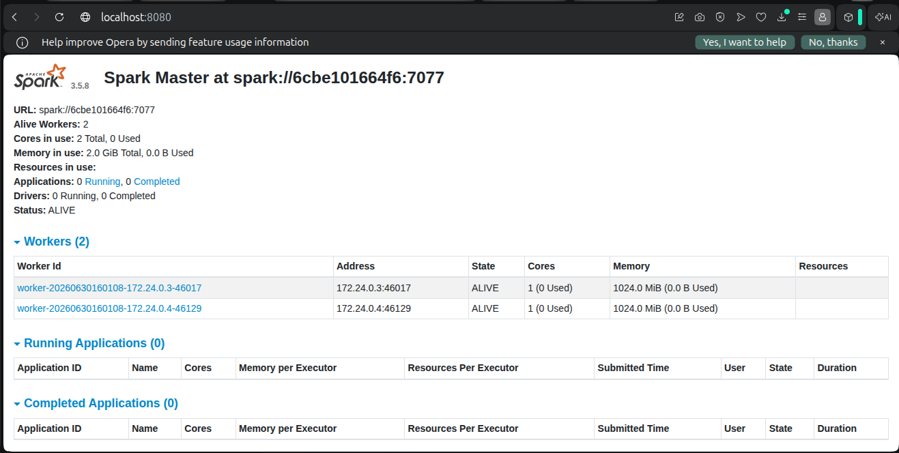
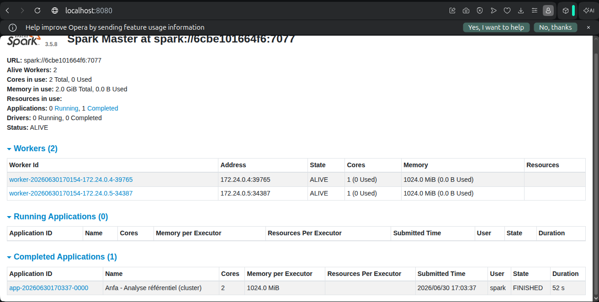
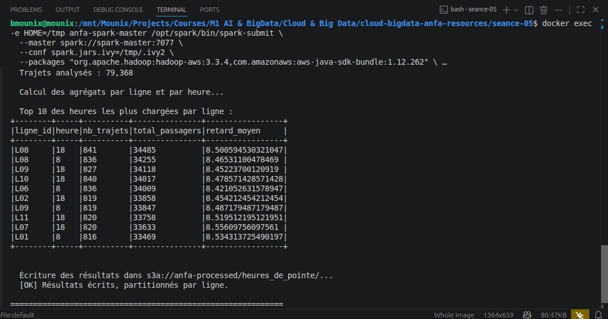
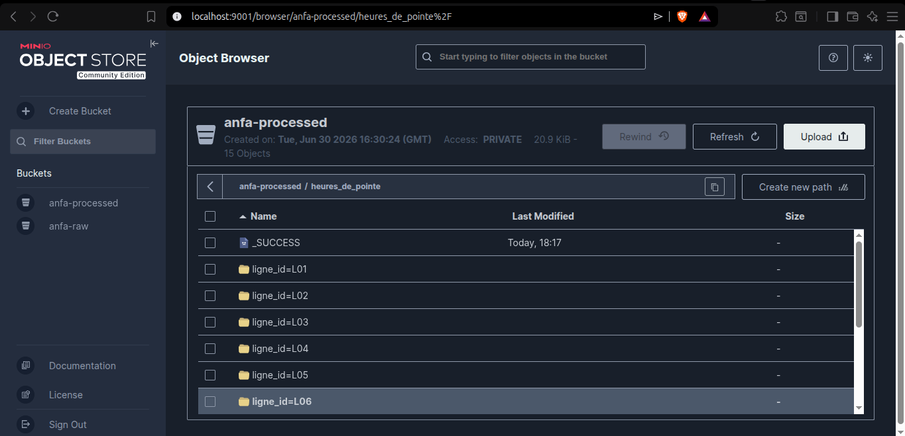

# Rendu Séance 5

**Nom et prénom :** BLAISE Mouné Tchoubou  
**Identifiant GitHub :** Mounix756  
**Date de soumission :** 30/06/2026

---

## Résumé de la séance

Dans cette séance, j'ai déployé un cluster Spark standalone (1 master + 2 workers) via Docker Compose, et exécuté de vrais jobs PySpark distribués sur le projet Anfa : lecture du référentiel depuis MinIO via le connecteur S3A, calcul de statistiques sur les bus et les lignes, génération d'un historique simulé de 79 368 trajets, et calcul des heures de pointe par ligne. Les résultats ont été écrits en Parquet dans la zone `anfa-processed`, avec un partitionnement par ligne pour le second job.

Ce qui m'a marqué : voir les 2 executors se répartir le travail dans le dashboard Spark Master, et comprendre concrètement le pattern data lake en zones (`raw` pour les données brutes, `processed` pour les résultats agrégés).

---

## Étapes principales

1. Synchronisation du fork avec le dépôt du cours pour récupérer `seance-05/` (docker-compose.yml + 4 jobs Python).
2. Déploiement du cluster Spark standalone (1 master + 2 workers, 1 Go RAM / 1 cœur chacun) via `docker compose up -d`.
3. Vérification du dashboard Spark Master (`http://localhost:8080`) : 2 workers ALIVE.
4. Préparation de MinIO : création des buckets `anfa-raw` et `anfa-processed`, génération de la clé applicative.
5. Upload du référentiel d'Anfa (4 CSV) dans MinIO depuis le conteneur Spark Master.
6. Premier job distribué (`analyse_referentiel_cluster.py`) : statistiques de base soumises via `spark-submit`, exécutées sur le cluster, résultats écrits en Parquet dans `anfa-processed/bus_par_ligne/`.
7. Génération d'un historique simulé de 79 368 trajets sur 30 jours (`generer_trajets.py`).
8. Job d'analyse des heures de pointe (`heures_de_pointe.py`) : agrégation par ligne et par heure, écriture partitionnée par `ligne_id` dans MinIO.
9. Arrêt propre de la stack avec `docker compose down`.

---

## Captures d'écran

### Dashboard Spark Master avec 2 workers

### Application Spark exécutée avec succès

### Résultats du Top 10 dans la console

### Bucket anfa-processed avec heures_de_pointe partitionné

---

## Réflexion : local vs cluster

Sur ce volume de données (12 lignes, 100 bus, 79 368 trajets), je n'ai pas observé de gain de temps flagrant avec le cluster par rapport au mode local de la séance 2 — les deux jobs se sont exécutés en moins d'une minute (52s et 46s). C'est cohérent avec ce que le TP annonçait : sur un petit volume, l'overhead de communication entre le Driver et les Executors (négociation des ressources, distribution des tâches, shuffle réseau) coûte plus cher que ce que le parallélisme rapporte.

Ce qui m'a aidé à comprendre l'intérêt réel du cluster : ce n'est pas la vitesse sur un petit jeu de données qui compte, mais la capacité à traiter des volumes qui dépasseraient la RAM d'une seule machine. Si Anfa devait un jour traiter des millions de positions GPS par jour, le cluster deviendrait indispensable — pas pour aller plus vite sur peu de données, mais pour pouvoir traiter ce qu'une seule machine ne pourrait simplement pas charger en mémoire.

Dans quel cas j'utiliserais l'un ou l'autre : mode local pour le développement et les tests rapides sur un échantillon de données (comme en séance 2), mode cluster dès que le volume de données réel dépasse ce qu'une seule machine peut gérer confortablement, ou si on a besoin de répartir la charge entre plusieurs jobs concurrents.

---

## Bonus Spark sur Kubernetes

Non réalisé pour cette séance, faute de temps disponible. Je le garde en perspective pour approfondir plus tard avec Spark Operator et Helm.

---

## Difficultés rencontrées

1. **Conflit de port et de nom de conteneur** au premier lancement : le `anfa-minio` d'une séance précédente tournait encore, et un processus Python local occupait le port 9001 (probablement un `kubectl port-forward` resté actif de la séance 3). Résolu en arrêtant le conteneur en conflit et en tuant le processus avec `kill`.

2. **Manque d'espace disque** en cours de séance, qui m'a forcé à faire un `docker system prune -a --volumes` pour libérer de la place. Cela a supprimé la stack Spark en cours, mais le volume MinIO a été conservé — j'ai pu relancer `docker compose up -d` et reprendre directement avec les buckets et données déjà en place, sans tout reconfigurer depuis zéro.

3. **Premier `spark-submit` un peu long** : le téléchargement des packages Maven (`hadoop-aws`, `aws-java-sdk-bundle`) a pris plus de 4 minutes au premier essai à cause d'une connexion lente, ce qui peut donner l'impression que le job est bloqué. Une fois les packages en cache local, les exécutions suivantes ont été beaucoup plus rapides (moins d'une minute).
