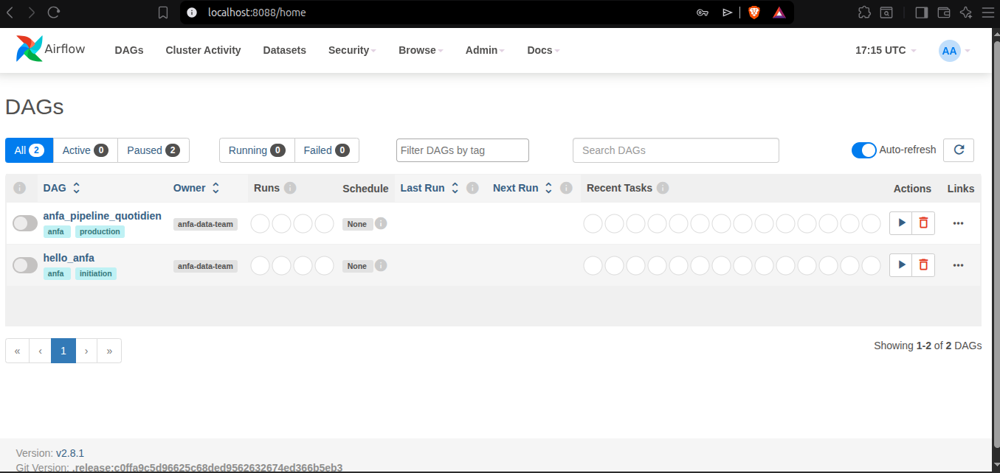
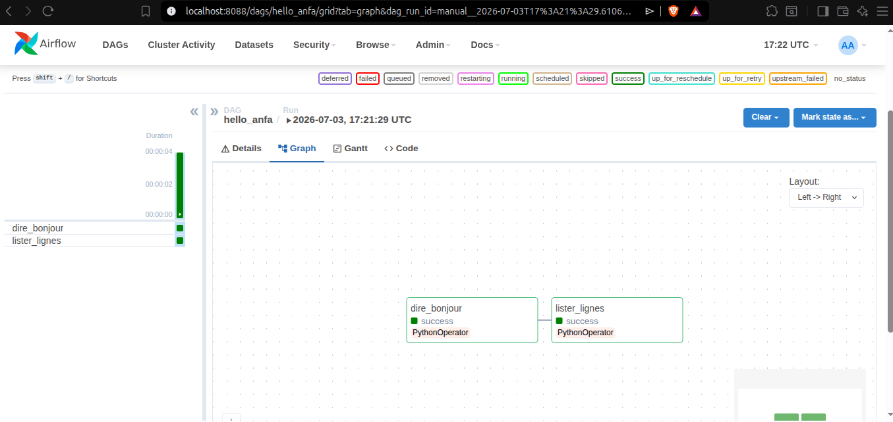
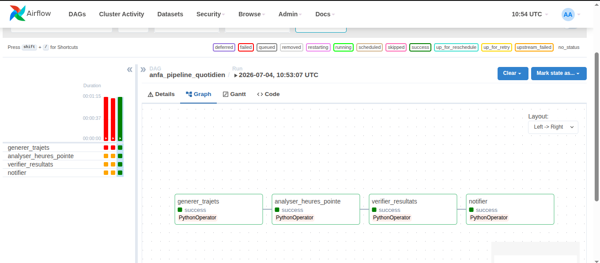
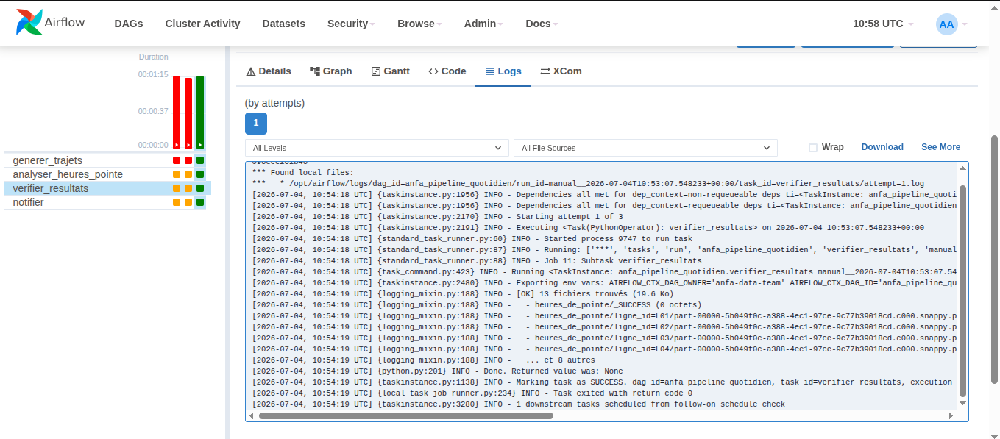
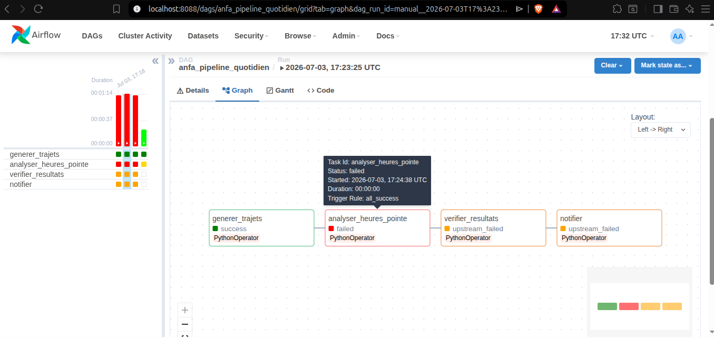

# Rendu Séance 6

**Nom et prénom :** BLAISE Mouné Tchoubou  
**Identifiant GitHub :** Mounix756  
**Date de soumission :** 03/07/2026

---

## Résumé de la séance

Dans cette séance, j'ai déployé Apache Airflow via Docker Compose avec MinIO et Spark, écrit et exécuté un premier DAG simple (`hello_anfa`) à 2 tâches pour comprendre la mécanique Airflow, puis déclenché le DAG métier `anfa_pipeline_quotidien` qui orchestre le pipeline complet d'Anfa : génération de trajets, analyse Spark des heures de pointe, vérification des résultats et notification. J'ai observé concrètement le comportement des retries et du mécanisme `upstream_failed` quand une tâche échoue.

---

## Étapes principales

1. Synchronisation du fork avec `upstream` pour récupérer `seance-06/` (docker-compose.yml, DAGs, scripts).
2. Correction du `docker-compose.yml` : remplacement de `postgres:18-alpine` par `postgres:15-alpine` (incompatibilité de chemin de données avec la v18).
3. Correction des permissions du dossier `logs/` (`chmod -R 777 logs/`) pour permettre à Airflow d'écrire ses logs.
4. Lancement de la stack complète (`docker compose up -d`) : PostgreSQL, Airflow (init + scheduler + webserver), MinIO, Spark (master + worker).
5. Initialisation de MinIO : buckets `anfa-raw` et `anfa-processed`, clé applicative `anfa-app-key`.
6. Vérification de l'UI Airflow sur `http://localhost:8088` : les 2 DAGs (`hello_anfa`, `anfa_pipeline_quotidien`) sont détectés automatiquement par le scheduler.
7. Exécution du DAG `hello_anfa` : 2 tâches (`dire_bonjour`, `lister_lignes`) en succès en quelques secondes.
8. Déclenchement du DAG `anfa_pipeline_quotidien` : observation des retries automatiques et du comportement `upstream_failed`.
9. Correction des permissions du socket Docker (`chmod 666 /var/run/docker.sock`) pour permettre à Airflow de soumettre le job Spark.
10. Pré-téléchargement des packages Maven dans le conteneur Spark pour accélérer les exécutions suivantes.

---

## Captures d'écran

### Page d'accueil Airflow avec les 2 DAGs


### DAG hello_anfa — Graph view après succès


### DAG anfa_pipeline_quotidien — Pipeline complet


### Logs de la tâche verifier_resultats


### Tâche en échec et upstream_failed


---

## Difficultés rencontrées

1. **`postgres:18-alpine` incompatible** : l'image PostgreSQL 18 a changé le chemin de stockage des données par rapport aux versions précédentes, ce qui rendait le conteneur `unhealthy`. Résolu en passant à `postgres:15-alpine`.

2. **Permission denied sur le dossier logs/** : Airflow ne pouvait pas créer ses fichiers de log au démarrage. Résolu avec `chmod -R 777 logs/`.

3. **Permission denied sur `/var/run/docker.sock`** : la tâche `analyser_heures_pointe` échouait car Airflow n'avait pas les droits pour parler au daemon Docker (nécessaire pour soumettre le job Spark via le SDK Docker). Résolu avec `sudo chmod 666 /var/run/docker.sock`.

4. **Plusieurs runs déclenchés en parallèle** : plusieurs clics sur le bouton Trigger ont créé plusieurs runs simultanés qui se disputaient les ressources. Résolu en marquant tous les runs en `Failed` et en tuant les processus Spark avec `pkill`.

5. **Téléchargement Maven lent** : les packages `hadoop-aws` et `aws-java-sdk-bundle` (~275 Mo) doivent être téléchargés à chaque nouveau conteneur Spark, ce qui peut prendre 10-15 minutes avec une connexion lente. Résolu en pré-téléchargeant les packages en mode local avant de lancer le pipeline.

---

## Exercices d'application

---

### Exercice 1 : QCM conceptuel

#### 1.1 — Définition d'un DAG

**Réponse : B. Un graphe orienté acyclique de tâches, où chaque tâche attend la réussite de ses parents avant de s'exécuter.**

Un DAG (Directed Acyclic Graph) définit les tâches et leurs dépendances sans cycle — une tâche ne peut pas dépendre d'elle-même directement ou indirectement. C'est ce qui garantit qu'Airflow peut toujours déterminer un ordre d'exécution valide.

---

#### 1.2 — Rôle du scheduler Airflow

**Réponse : B. Il scanne les DAGs, détermine quelles tâches sont prêtes à s'exécuter, et les soumet à l'executor.**

Le scheduler est le cerveau d'Airflow : il lit les fichiers Python du dossier `dags/`, évalue les dépendances et le planning, et décide quelles tâches peuvent être lancées. Il ne les exécute pas lui-même — il délègue à l'executor.

---

#### 1.3 — Différence entre schedule_interval=None et catchup=False

**Réponse :** Ce sont deux paramètres distincts. `schedule_interval=None` signifie que le DAG ne se déclenche jamais automatiquement — uniquement à la main. `catchup=False` signifie que si on active un planning (ex. `@daily`), Airflow ne rattrapera pas les exécutions passées depuis `start_date`. Les deux sont indépendants : un DAG peut avoir `schedule_interval="@daily"` et `catchup=False` (tourne chaque jour mais ne rattrape pas le passé).

---

#### 1.4 — Qu'est-ce que l'idempotence dans un DAG ?

**Réponse : B. La propriété qu'une tâche peut être rejouée plusieurs fois sans produire des effets indésirables.**

Une tâche idempotente produit le même résultat qu'on la lance 1 fois ou 10 fois. C'est crucial en orchestration : si une tâche échoue et est relancée, elle ne doit pas doubler les données ou créer des incohérences. Par exemple, écrire en Parquet avec `mode("overwrite")` est idempotent — écrire avec `mode("append")` ne l'est pas.

---

#### 1.5 — Que signifie upstream_failed ?

**Réponse : B. Une tâche en amont a échoué, donc cette tâche n'a pas été exécutée.**

On l'a observé en TP : quand `analyser_heures_pointe` échouait, `verifier_resultats` et `notifier` passaient automatiquement en `upstream_failed` — Airflow ne les lance pas car leurs prérequis ne sont pas satisfaits.

---

#### 1.6 — Rôle des retries dans Airflow

**Réponse : B. Airflow relance automatiquement la tâche un nombre défini de fois avant de la marquer comme échouée.**

Dans `default_args`, `retries=2` et `retry_delay=timedelta(seconds=30)` signifient qu'Airflow va retenter la tâche 2 fois (3 tentatives au total) avec 30 secondes d'attente entre chaque. On l'a observé concrètement quand la permission Docker était manquante.

---

#### 1.7 — Différence entre PythonOperator et BashOperator

**Réponse :** Le `PythonOperator` exécute une fonction Python définie dans le DAG — c'est le plus flexible et le plus utilisé pour appeler des scripts, des APIs, ou du code métier. Le `BashOperator` exécute une commande shell — utile pour lancer des scripts bash, des CLI, ou des commandes système. En pratique, on préfère le `PythonOperator` car il est plus testable et plus intégré à l'écosystème Python.

---

#### 1.8 — Pourquoi le job Spark ne tourne pas dans le conteneur Airflow ?

**Réponse :** L'image Airflow n'a pas Java installé, et Spark nécessite une JVM pour fonctionner. Au lieu d'installer Java dans Airflow (ce qui alourdirait l'image), on utilise le SDK Docker Python (`docker.from_env()`) pour soumettre `spark-submit` dans le conteneur Spark Master qui, lui, a Java. C'est le socket Docker (`/var/run/docker.sock`) monté dans Airflow qui permet cette communication.

---

### Exercice 2 : Lecture et analyse d'un DAG

```python
with DAG(
    dag_id="hello_anfa",
    schedule_interval=None,
    start_date=datetime(2026, 1, 1),
    catchup=False,
    default_args=default_args,
    tags=["initiation", "anfa"],
) as dag:
    t1 = PythonOperator(task_id="dire_bonjour", python_callable=dire_bonjour)
    t2 = PythonOperator(task_id="lister_lignes", python_callable=lister_lignes)
    t1 >> t2
```

**2.1 — Ce que fait chaque ligne importante :**

- `dag_id="hello_anfa"` : identifiant unique du DAG dans Airflow.
- `schedule_interval=None` : pas d'exécution automatique, déclenchement manuel uniquement.
- `start_date=datetime(2026, 1, 1)` : date de référence pour le planning (sans effet ici puisque `schedule_interval=None`).
- `catchup=False` : pas de rattrapage des exécutions passées.
- `t1 >> t2` : `t2` ne démarre qu'après le succès de `t1`.

**2.2 — Que se passe-t-il si dire_bonjour échoue ?**

`lister_lignes` passe en `upstream_failed` et n'est pas exécutée. Airflow arrête le pipeline dès qu'une tâche échoue, sauf si on configure `trigger_rule` différemment.

**2.3 — Comment modifier pour que lister_lignes s'exécute même si dire_bonjour échoue ?**

```python
t2 = PythonOperator(
    task_id="lister_lignes",
    python_callable=lister_lignes,
    trigger_rule="all_done"  # s'exécute quelles que soient les tâches amont
)
```

---

### Exercice 3 : Diagnostic

**3.1 — DAG qui n'apparaît pas dans l'UI**

a. Causes possibles : erreur de syntaxe Python dans le fichier DAG, import manquant, indentation incorrecte, ou fichier pas encore scanné par le scheduler (délai de 30 secondes).

b. Commande de diagnostic :
```bash
docker compose logs anfa-airflow-scheduler | grep -i "dag_id\|error\|import"
```

c. Le scheduler scanne le dossier `dags/` toutes les 30 secondes par défaut — il faut attendre ce délai après avoir créé ou modifié un fichier.

---

**3.2 — Tâche qui reste en "running" indéfiniment**

a. Causes probables : processus bloqué sur une ressource (réseau, download), deadlock, ou manque de mémoire qui fait swapper le système.

b. Pour diagnostiquer :
```bash
# Voir les logs de la tâche dans Airflow
# Puis vérifier les processus dans le conteneur concerné
docker exec anfa-spark-master ps aux
```

c. Pour corriger : tuer le processus bloqué (`pkill`), marquer la tâche en `Failed` dans l'UI, corriger la cause racine, et relancer.

---

### Exercice 4 : Conception d'un DAG

**Pipeline quotidien pour Anfa — structure proposée :**

```python
with DAG(
    dag_id="anfa_pipeline_quotidien_v2",
    schedule_interval="0 2 * * *",  # tous les jours à 2h du matin
    start_date=datetime(2026, 1, 1),
    catchup=False,
    default_args={
        "retries": 2,
        "retry_delay": timedelta(minutes=5),
        "email_on_failure": True,
    }
) as dag:

    verifier_minio = PythonOperator(
        task_id="verifier_minio",
        python_callable=check_minio_connexion
    )

    generer_trajets = PythonOperator(
        task_id="generer_trajets",
        python_callable=generer_trajets_fn
    )

    analyser_spark = PythonOperator(
        task_id="analyser_heures_pointe",
        python_callable=soumettre_job_spark
    )

    verifier_resultats = PythonOperator(
        task_id="verifier_resultats",
        python_callable=check_parquet_output
    )

    notifier = PythonOperator(
        task_id="notifier",
        python_callable=envoyer_notification
    )

    verifier_minio >> generer_trajets >> analyser_spark >> verifier_resultats >> notifier
```

**Justifications :**
- `schedule_interval="0 2 * * *"` : exécution nocturne à 2h pour ne pas impacter la prod.
- Tâche `verifier_minio` ajoutée en amont : vérifie que MinIO est accessible avant de commencer — fail fast.
- `retries=2` avec `retry_delay=5min` : donne le temps aux ressources de se libérer entre les tentatives.
- Pipeline linéaire : chaque étape valide la précédente avant de continuer.

---

### Exercice 5 : Mini-cas d'architecture

**5.1 — Fréquence d'exécution recommandée**

`schedule_interval="0 2 * * *"` (tous les jours à 2h du matin). Le pipeline traite les données de la veille — une exécution nocturne évite la concurrence avec les traitements temps réel de la journée et garantit que toutes les données du jour sont disponibles.

---

**5.2 — Gestion de l'idempotence**

Pour rendre le pipeline idempotent :
- Écrire les résultats Parquet avec `mode("overwrite")` — rejouer le pipeline pour une date donnée écrase les anciens résultats plutôt que de les doubler.
- Utiliser une clé de partition date (`partitionBy("date")`) — seule la partition du jour concerné est réécrite.
- Nommer les fichiers de sortie avec la date logique d'exécution (`{{ ds }}` en template Airflow) pour éviter les collisions.

---

**5.3 — Que faire si le job Spark échoue à 3h du matin ?**

1. Airflow retente automatiquement (selon `retries` configuré).
2. Si tous les retries échouent, une alerte email/Slack est envoyée (si configuré dans `default_args`).
3. Le lendemain matin, l'équipe consulte les logs dans l'UI Airflow, identifie la cause.
4. Après correction, elle fait un **Clear** sur la tâche en échec — Airflow relance uniquement depuis cette tâche, sans rejouer les tâches déjà réussies.
5. Si la donnée du jour manquant est critique, on peut faire un **backfill** manuel pour une date précise.

---

**5.4 — Limites d'Airflow pour ce cas d'usage**

1. **Pas de streaming natif** : Airflow est un orchestrateur batch — pour des prédictions toutes les heures, il faudrait compléter avec Kafka ou Spark Structured Streaming.
2. **Pas de dépendances inter-DAGs natives** : si le pipeline dépend d'un autre flux de données (ex. données météo), la gestion des dépendances entre DAGs est complexe.
3. **Scalabilité du scheduler** : avec le LocalExecutor (utilisé en TP), les tâches sont limitées à un seul nœud — en production avec de nombreux DAGs, il faudrait passer au CeleryExecutor ou KubernetesExecutor.
