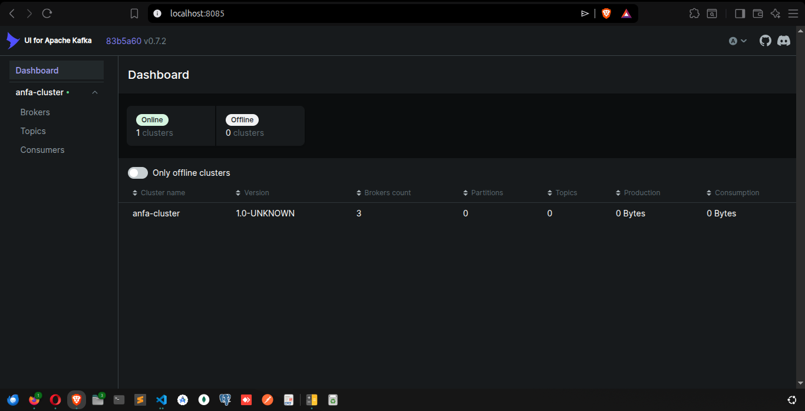
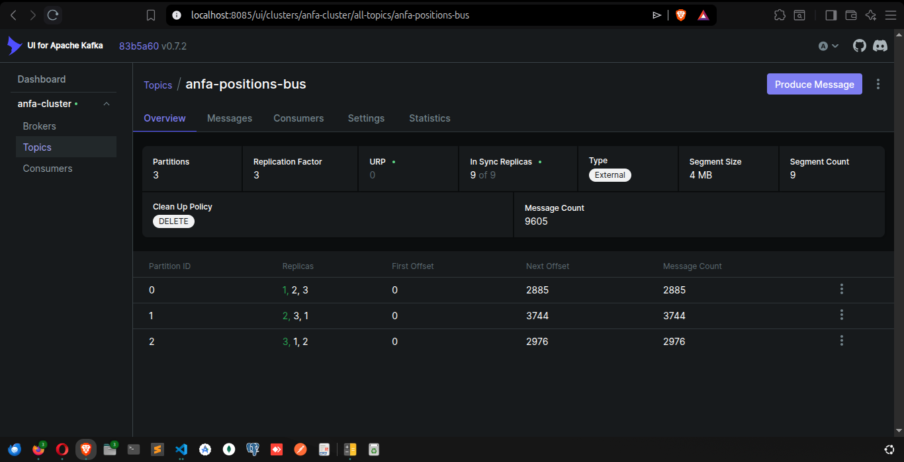
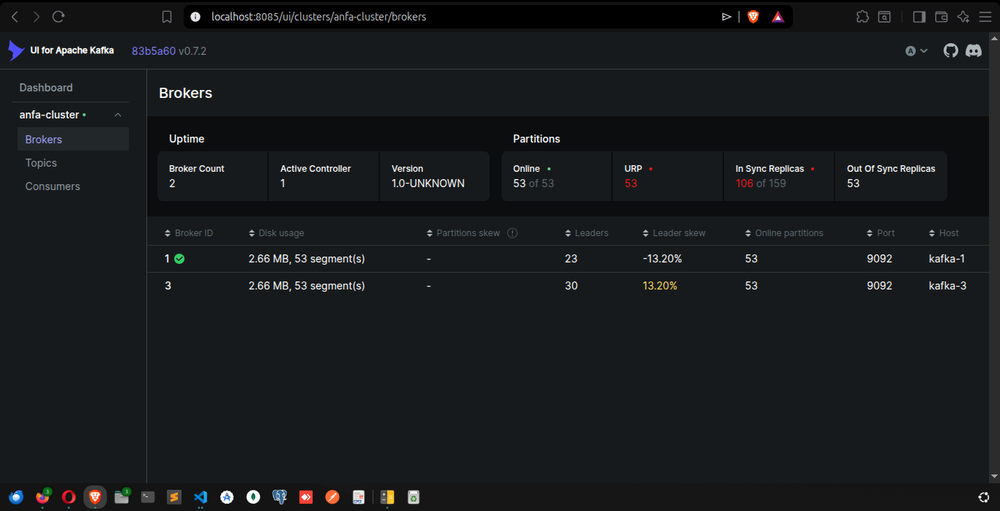
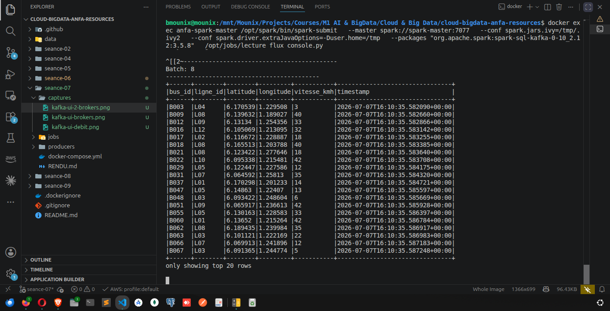
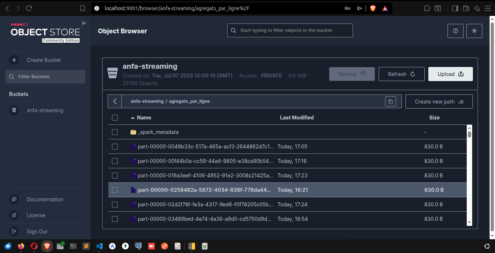

# Rendu Séance 7

**Nom et prénom :** BLAISE Mouné Tchoubou  
**Identifiant GitHub :** Mounix756  
**Date de soumission :** 07/07/2026

---

## Résumé de la séance

Dans cette séance, j'ai déployé un cluster Kafka à 3 brokers en mode KRaft (sans Zookeeper), créé un topic partitionné et répliqué, simulé 100 bus Anfa envoyant leur position GPS en continu, observé la tolérance aux pannes en tuant un broker, puis consommé ce flux avec Spark Structured Streaming pour calculer des agrégats en fenêtres temporelles et les écrire en Parquet dans MinIO.

Ce qui m'a le plus marqué : quand j'ai tué `anfa-kafka-2`, le simulateur a continué d'envoyer des messages sans aucune interruption. Kafka a automatiquement basculé les leaders de partition vers les brokers restants — c'est la promesse de la réplication en action.

---

## Étapes principales

1. Synchronisation du fork et création de la branche `seance-07`.
2. Lancement de la stack complète via `docker compose up -d` : 3 brokers Kafka (mode KRaft), Kafka UI, MinIO, Spark Master + Worker.
3. Vérification des 3 brokers dans Kafka UI sur `http://localhost:8085`.
4. Création du topic `anfa-positions-bus` avec 3 partitions et replication factor 3.
5. Test du producer et consumer Python simples : 5 messages envoyés, lus, puis non-relus (offset déjà consommé).
6. Lancement du simulateur de flotte (`simulateur_flotte.py`) : 100 bus, ~100 messages/seconde.
7. Démonstration de tolérance aux pannes : `docker stop anfa-kafka-2` → 2 brokers actifs, flux continu sans interruption → `docker start anfa-kafka-2`.
8. Job Spark Structured Streaming 1 : lecture du flux Kafka en console (`lecture_flux_console.py`), micro-batchs de positions GPS visibles.
9. Job Spark Structured Streaming 2 : agrégation en fenêtres de 30 secondes (`agregation_streaming.py`), résultats écrits en Parquet dans `anfa-streaming/agregats_par_ligne/`.
10. Correction du problème réseau Docker (iptables FORWARD) pour donner accès internet aux conteneurs Spark.

---

## Captures d'écran

### Kafka UI — 3 brokers actifs


### Kafka UI — Débit de messages en augmentation


### Kafka UI — 2 brokers actifs après panne de kafka-2


### Spark Structured Streaming — Micro-batchs en console


### MinIO — Agrégats Parquet dans anfa-streaming


---

## Difficultés rencontrées

1. **Problème réseau Docker (iptables)** : les conteneurs Spark n'avaient pas accès à internet après la réinstallation de Docker. Résolu en ajoutant manuellement les règles FORWARD pour le bridge réseau de la stack avec `sudo iptables -I FORWARD -i br-<id> -j ACCEPT`.

2. **Conflit de ressources Spark** : avec un seul worker (1 core), plusieurs applications Spark en WAITING. Il faut tuer les applications précédentes avant d'en lancer une nouvelle via l'UI Spark sur `http://localhost:8091`.

3. **startingOffsets="latest"** : le job Spark ne lisait rien si le simulateur n'était pas actif au moment du démarrage du job. Il faut toujours lancer le simulateur avant le job Streaming.

---

## Exercices d'application

---

### Exercice 1 : QCM conceptuel

#### 1.1 — Rôle principal d'Apache Kafka

**Réponse : B. Un broker de messages distribué et persistant, conçu pour les flux de données à haute volumétrie.**

Kafka n'est pas une base de données transactionnelle ni un simple bus de messages en mémoire — c'est un système de streaming distribué qui persiste les messages sur disque et peut traiter des millions de messages par seconde.

---

#### 1.2 — Garantie offerte par la clé de partition

**Réponse : B. Tous les messages avec la même clé arrivent dans la même partition, dans l'ordre.**

C'est ce qu'on a observé en TP : tous les messages avec la clé `"B001"` sont allés dans la partition 0. Pour Anfa, utiliser `bus_id` comme clé garantit que toutes les positions d'un même bus sont traitées dans l'ordre.

---

#### 1.3 — Que se passe-t-il si on relance un consumer avec le même group_id ?

**Réponse : B. Il ne relit pas les messages déjà consommés — il reprend à l'offset où le groupe s'était arrêté.**

On l'a vérifié en TP : la deuxième exécution de `premier_consumer.py` avec le même `group_id` n'a affiché aucun message. Kafka a mémorisé l'offset du groupe.

---

#### 1.4 — Rôle du mode KRaft

**Réponse : B. Il remplace Zookeeper pour la coordination du cluster, en intégrant la gestion des métadonnées directement dans les brokers.**

En mode KRaft, chaque broker peut jouer le rôle de `controller` (coordination) et/ou `broker` (stockage). Zookeeper n'est plus nécessaire, ce qui simplifie l'architecture.

---

#### 1.5 — Que signifie KAFKA_MIN_INSYNC_REPLICAS: 2 ?

**Réponse : B. Il faut au moins 2 répliques synchronisées pour qu'une écriture soit confirmée au producer.**

C'est le compromis durabilité/disponibilité : avec 3 brokers et `min.insync.replicas=2`, une écriture est confirmée dès que 2 brokers l'ont reçue. Si un broker tombe, le cluster peut encore écrire — mais si 2 tombent, les écritures sont bloquées.

---

#### 1.6 — Différence entre readStream et read dans Spark

**Réponse : B. `readStream` crée un flux continu traité en micro-batchs ; `read` charge un snapshot statique des données.**

C'est la seule vraie différence syntaxique entre le traitement batch et le streaming dans Spark — le reste du code (transformations, agrégations) est quasi-identique.

---

#### 1.7 — Rôle du watermark dans Spark Structured Streaming

**Réponse : B. Il définit la tolérance aux messages en retard et permet à Spark de libérer la mémoire des fenêtres fermées.**

Sans watermark, Spark devrait garder en mémoire toutes les fenêtres ouvertes indéfiniment. Avec `withWatermark("event_time", "1 minute")`, Spark sait qu'il peut fermer et écrire une fenêtre dès qu'aucun message en retard de plus d'1 minute ne peut encore arriver.

---

#### 1.8 — Pourquoi utiliser outputMode("append") pour les agrégations en fenêtre ?

**Réponse : B. Chaque fenêtre n'est écrite qu'une seule fois, quand elle est définitivement close grâce au watermark.**

En mode `append`, une fenêtre n'apparaît dans la sortie qu'après sa fermeture — ce qui garantit que les agrégats sont complets et ne seront pas mis à jour. C'est ce qu'on a utilisé dans `agregation_streaming.py`.

---

### Exercice 2 : Lecture et analyse

#### 2.1 — Pourquoi 3 partitions pour le topic anfa-positions-bus ?

Avec 100 bus et 3 lignes de traitement possibles, 3 partitions permettent de paralléliser le traitement : chaque executor Spark peut traiter une partition indépendamment. De plus, 3 partitions correspondent aux 3 brokers — Kafka peut répartir 1 leader par broker, équilibrant la charge d'écriture.

---

#### 2.2 — Que se passe-t-il si kafka-2 tombe et que c'était le leader de la partition 1 ?

Kafka élit automatiquement un nouveau leader parmi les répliques synchronisées (ISR — In-Sync Replicas) de la partition 1, soit kafka-1 ou kafka-3. Le producer est redirigé vers le nouveau leader sans interruption visible. C'est exactement ce qu'on a observé en TP : le simulateur a continué sans erreur.

---

#### 2.3 — Pourquoi utiliser key=bus_id dans le producer ?

La clé détermine la partition de destination. En utilisant `bus_id` comme clé, toutes les positions d'un même bus vont dans la même partition, ce qui garantit leur ordre chronologique. Un consumer ou un job Spark lisant cette partition reçoit les positions dans l'ordre — indispensable pour calculer la vitesse, détecter les anomalies, ou reconstituer le trajet.

---

### Exercice 3 : Diagnostic

#### 3.1 — NoBrokersAvailable depuis un script Python

**Cause :** le script utilise les ports internes (`9092`) au lieu des ports externes (`19092`, `19093`, `19094`). Les ports internes ne sont accessibles qu'entre conteneurs Docker, pas depuis la machine hôte.

**Correction :**
```python
producer = KafkaProducer(
    bootstrap_servers=["localhost:19092", "localhost:19093", "localhost:19094"],
    ...
)
```

---

#### 3.2 — Le job Spark ne reçoit aucun message

**Cause :** `startingOffsets="latest"` signifie que le job ne lit que les messages arrivés **après** son démarrage. Si le simulateur ne tourne pas, aucun nouveau message n'arrive.

**Solutions :**
- Lancer le simulateur **avant** le job Spark.
- Ou changer en `startingOffsets="earliest"` pour lire l'historique (utile pour le rejeu).

---

#### 3.3 — FileNotFoundException: /nonexistent/.ivy2

**Cause :** l'image `apache/spark` définit `HOME=/nonexistent` pour l'utilisateur `spark`. Ivy (gestionnaire de dépendances Maven) essaie d'écrire son cache dans `$HOME/.ivy2` — qui n'existe pas et n'est pas accessible en écriture.

**Correction :** ajouter ces deux options à `spark-submit` :
```bash
--conf spark.jars.ivy=/tmp/.ivy2
--conf spark.driver.extraJavaOptions=-Duser.home=/tmp
```

---

### Exercice 4 : Architecture

#### 4.1 — Pourquoi Kafka plutôt qu'une API REST pour les positions GPS ?

Une API REST est synchrone — chaque bus doit attendre la réponse du serveur avant d'envoyer la position suivante. Avec 100 bus envoyant 1 position/seconde, c'est 100 requêtes/seconde en pointe, avec latence accumulée. Kafka est asynchrone : les bus publient sans attendre, Kafka bufferise et les consommateurs lisent à leur rythme. De plus, Kafka persiste les messages — si un consommateur tombe, il peut rattraper le retard. Une API REST perd les données si le consommateur est absent.

---

#### 4.2 — Que faudrait-il changer pour passer de 100 à 10 000 bus ?

1. **Augmenter le nombre de partitions** du topic (ex. 12 au lieu de 3) pour paralléliser davantage le traitement.
2. **Augmenter le nombre de workers Spark** pour avoir plus de parallélisme en lecture.
3. **Augmenter le nombre de brokers Kafka** (ex. 5 au lieu de 3) pour répartir la charge d'écriture.
4. **Ajuster `KAFKA_MIN_INSYNC_REPLICAS`** si nécessaire pour le compromis durabilité/débit.
5. **Réduire la taille des fenêtres** d'agrégation si la latence doit rester faible.

---

### Exercice 5 : Mini-cas d'architecture

#### 5.1 — Architecture pour détecter les bus en retard en temps réel

**Pipeline proposé :**

```
Bus GPS → Kafka (anfa-positions-bus)
            ↓
        Spark Structured Streaming
            ↓ withWatermark + window
        Agrégation par ligne (nb_bus, retard_moyen)
            ↓
        MinIO (anfa-streaming/alertes/)  ← résultats
        + alertes si retard_moyen > seuil → Kafka (anfa-alertes)
            ↓
        Dashboard (consomme anfa-alertes)
```

**Justifications :**
- Kafka absorbe les pics de positions sans bloquer les bus.
- Spark Structured Streaming calcule le retard moyen par ligne toutes les 30 secondes.
- `withWatermark` évite l'accumulation infinie d'état en mémoire.
- Les alertes sont publiées dans un second topic Kafka pour découpler la détection de l'affichage.

---

#### 5.2 — Pourquoi partitionner par bus_id et non par ligne_id ?

Partitionner par `bus_id` garantit l'ordre des positions **par bus** — indispensable pour calculer la vitesse (distance/temps entre deux positions consécutives) ou détecter un arrêt prolongé. Partitionner par `ligne_id` mélangerait les positions de plusieurs bus dans la même partition, rendant impossible le suivi individuel d'un bus.

---

#### 5.3 — Durée de rétention des données dans Kafka

Pour Anfa, une rétention de **7 jours** est recommandée. Cela permet de rejouer une semaine de données en cas de panne d'un consommateur (Spark, dashboard) sans avoir à les récupérer depuis MinIO. Au-delà, les données historiques sont dans MinIO en Parquet pour les analyses long terme. La rétention Kafka est configurée avec `retention.ms=604800000` (7 jours en ms).
