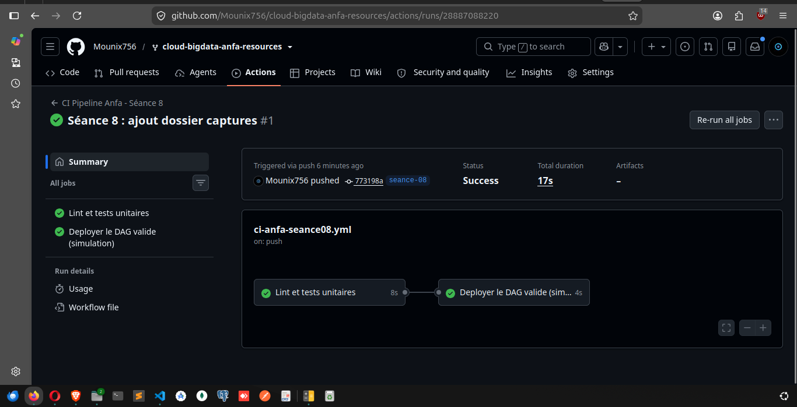
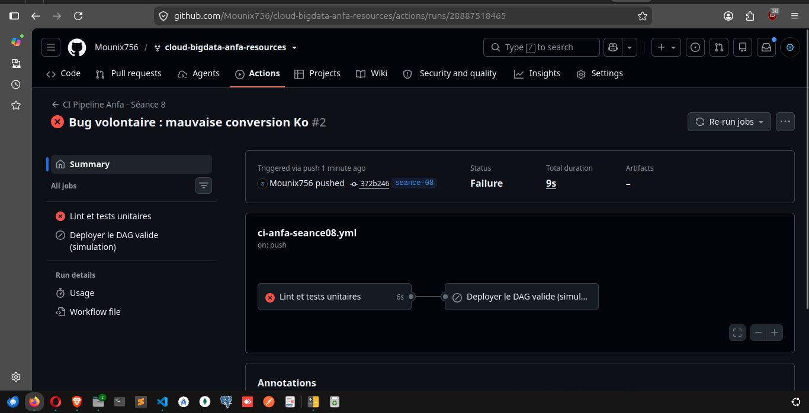

# Rendu Séance 8

**Nom et prénom :** BLAISE Mouné Tchoubou  
**Identifiant GitHub :** Mounix756  
**Date de soumission :** 07/07/2026

---

## Résumé de la séance

Dans cette séance, j'ai mis en place un pipeline CI/CD complet avec GitHub Actions pour le DAG Airflow d'Anfa. J'ai d'abord séparé la logique métier du DAG dans un module Python indépendant (`anfa_logic.py`), écrit 5 tests unitaires avec pytest, puis configuré un workflow GitHub Actions qui exécute automatiquement lint (flake8) + tests à chaque push sur la branche `seance-08`. J'ai observé le pipeline bloquer un déploiement quand un bug a été introduit, et le laisser passer quand tout est vert.

Ce qui m'a le plus marqué : le pipeline a détecté le bug de conversion Ko (1000 au lieu de 1024) en 9 secondes, sans que j'aie besoin de tester manuellement. C'est exactement ce qui aurait évité le bug de Mawuli dans la situation-problème du CM.

---

## Étapes principales

1. Synchronisation du fork et création de la branche `seance-08`.
2. Vérification que `.github/workflows/ci-anfa-seance08.yml` est bien à la racine du dépôt.
3. Installation des dépendances (`pytest`, `flake8`) et exécution des 5 tests localement — tous passent en 0.03s.
4. Vérification du lint avec `flake8 dags/ tests/ --max-line-length=100` — aucune erreur.
5. Commit et push sur `seance-08` → le workflow GitHub Actions se déclenche automatiquement.
6. Observation des 2 jobs en succès : **Lint et tests unitaires** (8s) → **Deployer le DAG valide** (4s).
7. Introduction du bug volontaire (`/ 1000` au lieu de `/ 1024`) et push → le job **Lint et tests unitaires** échoue, **Deployer** est skipped.
8. Correction du bug et push final.

---

## Captures d'écran

### CI en succès — 2 jobs verts


### CI en échec — bug détecté, déploiement bloqué


---

## Difficultés rencontrées

Le premier push n'a pas déclenché le workflow car `git add seance-08/` n'avait rien à commiter — les fichiers étaient déjà trackés depuis le `main`. Il a fallu créer un fichier supplémentaire (`captures/.gitkeep`) pour avoir un changement réel à commiter dans `seance-08/`, ce qui a déclenché le workflow.

---

## Exercices d'application

---

### Exercice 1 : QCM conceptuel

#### 1.1 — Définition du CI/CD

**Réponse : B. Continuous Integration / Continuous Delivery — automatiser les tests à chaque changement et la livraison du code validé.**

CI = chaque développeur intègre ses changements fréquemment, déclenchant des tests automatiques. CD = le code validé est livré automatiquement en production (ou préparé pour l'être). C'est exactement ce qu'on a mis en place : push → tests → déploiement simulé.

---

#### 1.2 — Pourquoi séparer la logique métier du DAG Airflow ?

**Réponse : B. Pour pouvoir tester la logique métier avec pytest sans installer Airflow, qui est lourd et inadapté à la CI.**

Airflow est une dépendance massive. En extrayant les fonctions pures dans `anfa_logic.py`, on peut les tester en CI avec juste `pip install pytest` — beaucoup plus rapide et léger.

---

#### 1.3 — Que fait `needs: valider-dag` dans le workflow ?

**Réponse : B. Le job `deployer` n'est exécuté que si `valider-dag` a réussi.**

C'est la dépendance entre jobs dans GitHub Actions. On l'a observé : quand le bug a fait échouer `valider-dag`, le job `deployer` a été automatiquement skipped — le code bogué n'a pas été déployé.

---

#### 1.4 — Que signifie `# noqa: E402` ?

**Réponse : B. Dire à flake8 d'ignorer l'erreur E402 sur cette ligne spécifique.**

E402 signale un import qui n'est pas en haut du fichier. Dans le fichier de tests, on doit modifier `sys.path` avant d'importer `anfa_logic`, ce qui crée une violation E402 légitime. Le `# noqa: E402` indique à flake8 que c'est intentionnel.

---

#### 1.5 — Que se passe-t-il si on pousse du code qui casse un test ?

**Réponse : B. Le job de tests échoue, le job de déploiement est skipped, et GitHub marque le commit en rouge.**

C'est exactement ce qu'on a observé avec le bug `/1000` : le test `test_verifier_liste_fichiers_calcule_correctement` a échoué, le déploiement a été bloqué, et le commit est apparu en rouge sur GitHub.

---

#### 1.6 — Pourquoi utiliser flake8 en plus de pytest ?

**Réponse : B. flake8 vérifie le style et la qualité du code (erreurs de syntaxe, imports inutilisés, lignes trop longues) indépendamment des tests fonctionnels.**

pytest vérifie que le code fait ce qu'il est censé faire. flake8 vérifie qu'il est écrit proprement. Les deux sont complémentaires : un code peut passer tous les tests mais avoir des problèmes de style qui nuisent à la maintenabilité.

---

#### 1.7 — Différence entre `on: push` et `on: pull_request`

**Réponse : B. `push` déclenche le workflow quand on pousse directement sur la branche ; `pull_request` le déclenche quand une PR est ouverte vers cette branche.**

Dans notre workflow, `deployer` a `if: github.event_name == 'push'` — il ne tourne pas sur une PR (on ne déploie pas depuis une PR, seulement depuis un push direct sur la branche).

---

### Exercice 2 : Lecture et analyse du workflow

```yaml
on:
  push:
    branches: ["seance-08"]
    paths:
      - "seance-08/**"
```

**2.1 — Pourquoi le filtre `paths: - "seance-08/**"` ?**

Sans ce filtre, le workflow se déclencherait pour n'importe quel push sur `seance-08`, même si on modifie un fichier d'une autre séance. Le filtre garantit que la CI ne tourne que quand les fichiers de `seance-08/` changent — ce qui économise des minutes GitHub Actions et évite des exécutions inutiles.

---

**2.2 — Pourquoi `working-directory: seance-08` ?**

Les commandes `flake8 dags/` et `pytest tests/` supposent qu'on est dans `seance-08/`. Sans ce paramètre, elles chercheraient `dags/` et `tests/` à la racine du dépôt, qui n'existent pas à cet emplacement.

---

**2.3 — Que fait le job `deployer` concrètement ?**

Il simule un déploiement en copiant les fichiers DAG dans un dossier `deploiement_simule/dags/`. En production réelle, cette étape copierait les DAGs sur le serveur Airflow, déclencherait une mise à jour Docker, ou publierait une image sur un registre. Ici c'est une simulation pédagogique.

---

### Exercice 3 : Diagnostic

#### 3.1 — Le workflow ne se déclenche pas

**Causes possibles :**
- Le fichier workflow n'est pas à la bonne place (`/.github/workflows/` à la racine, pas dans `seance-08/`)
- Aucun fichier de `seance-08/**` n'a changé dans le commit (filtre `paths` non satisfait)
- La branche poussée n'est pas `seance-08` (filtre `branches`)

**Diagnostic :** vérifier l'onglet Actions → aucun run = le workflow n'a pas été déclenché. Vérifier le chemin du fichier `.yml` et que les `paths` correspondent aux fichiers modifiés.

---

#### 3.2 — flake8 échoue avec E402

**Cause :** les commentaires `# noqa: E402` ont été supprimés des lignes d'import dans `test_anfa_logic.py`.

**Correction :** remettre `# noqa: E402` sur les lignes concernées :
```python
import pytest  # noqa: E402
from anfa_logic import (  # noqa: E402
    construire_cle_trajets,
    ...
)
```

---

#### 3.3 — `deployer` est "Skipped" alors que les tests passent

**Cause :** le workflow a été déclenché par un événement `pull_request` et non `push`. Le job `deployer` a `if: github.event_name == 'push'` — il ne tourne pas sur une PR.

**Solution :** pousser directement sur `seance-08` avec `git push` plutôt que de passer par une Pull Request.

---

### Exercice 4 : Conception

#### 4.1 — Ajouter un test pour `construire_cle_trajets` avec une date personnalisée

```python
def test_construire_cle_trajets_date_personnalisee():
    cle = construire_cle_trajets(date_str="2026-01-15")
    assert cle == "trajets/trajets_2026-01-15.csv"
```

---

#### 4.2 — Pourquoi ne pas tester `verifier_resultats` directement (la tâche Airflow) ?

La fonction `verifier_resultats` dans le DAG fait appel à boto3 et MinIO — des dépendances réseau externes. Tester ça en CI nécessiterait soit un MinIO de test (infrastructure lourde), soit des mocks complexes. En extrayant la logique pure dans `verifier_liste_fichiers(objets)`, on peut tester le comportement sans aucune dépendance externe — on passe simplement une liste Python.

---

### Exercice 5 : Mini-cas d'architecture CI/CD pour Anfa

#### 5.1 — Pipeline CI/CD complet pour Anfa en production

```yaml
jobs:
  lint-tests:
    # Lint flake8 + pytest sur anfa_logic.py
    
  build-image:
    needs: lint-tests
    # docker build de l'image Airflow avec les DAGs
    # docker push vers le registre
    
  deploy-staging:
    needs: build-image
    # Déploiement sur l'environnement de staging
    # Tests d'intégration (smoke tests)
    
  deploy-production:
    needs: deploy-staging
    if: github.ref == 'refs/heads/main'
    # Déploiement en production (uniquement depuis main)
```

**Justifications :**
- On ne build l'image que si les tests passent.
- On ne déploie en prod que si le staging est validé.
- La prod est protégée par `if: github.ref == 'refs/heads/main'` — les branches de développement ne touchent pas la prod.

---

#### 5.2 — Comment éviter que Mawuli déploie du code non testé ?

1. **Protection de branche** : configurer une règle sur `main` qui exige que la CI soit verte avant de permettre le merge.
2. **Pull Requests obligatoires** : interdire le push direct sur `main`, forcer le passage par une PR revue par un collègue.
3. **Environnements GitHub** : définir un environnement `production` avec des approbateurs manuels requis avant le déploiement final.

Avec ces 3 mesures, même si Mawuli pousse du code bogué, la CI l'arrête avant le merge, et si par miracle ça passe, un approbateur humain voit la PR avant le déploiement en prod.
