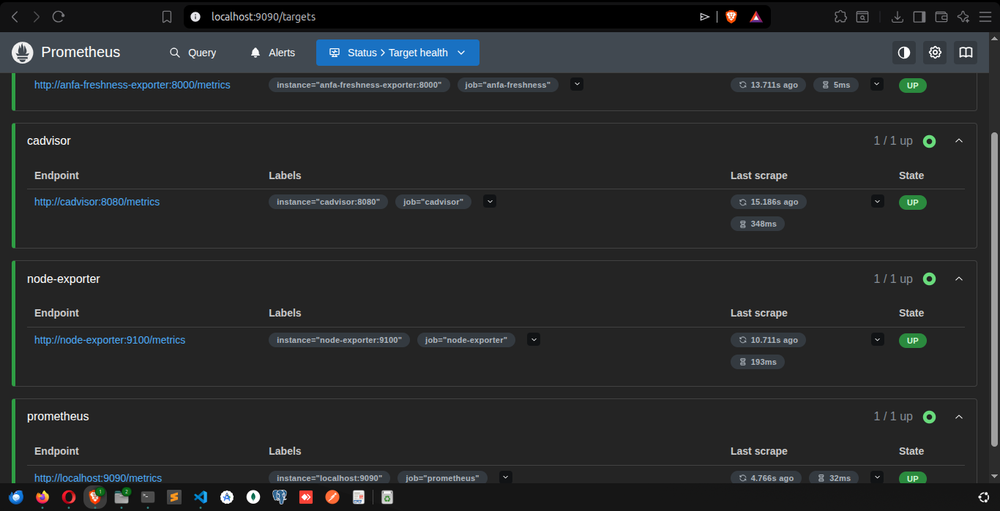
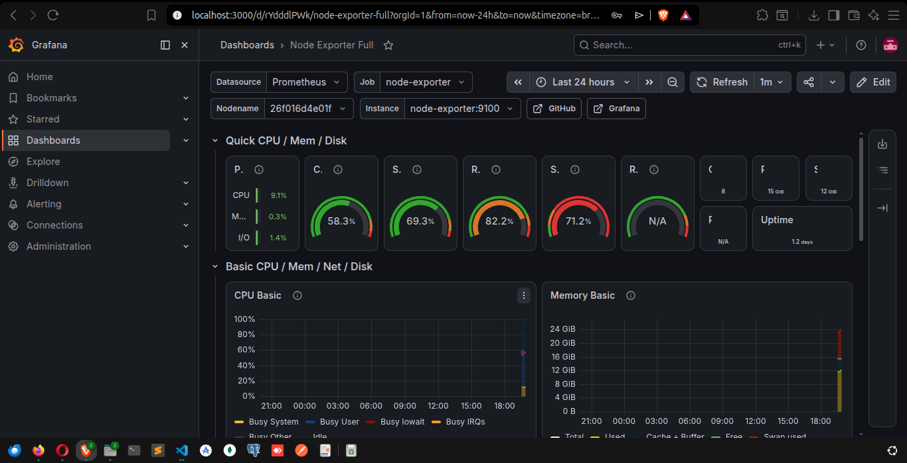
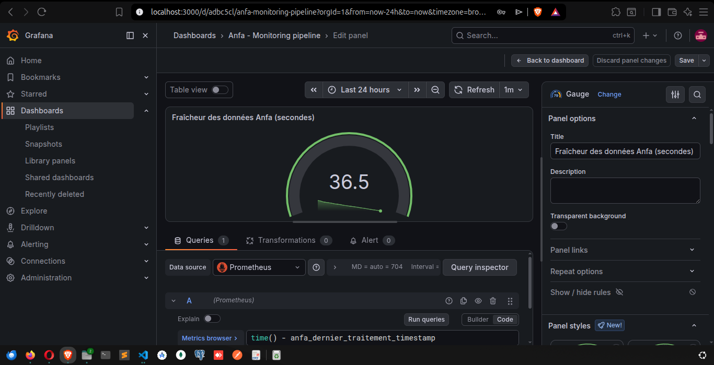
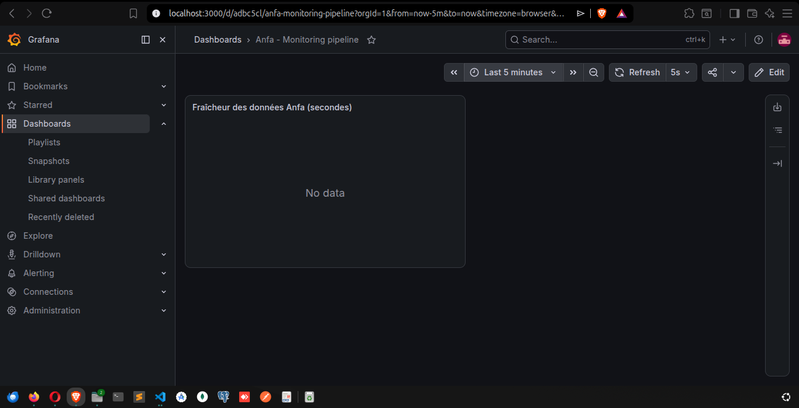
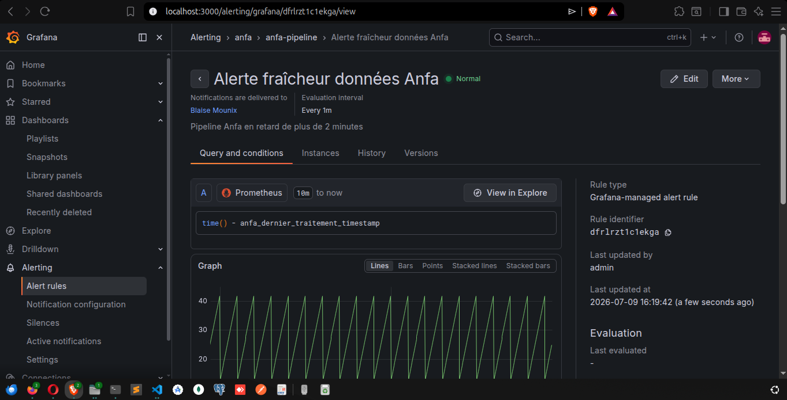
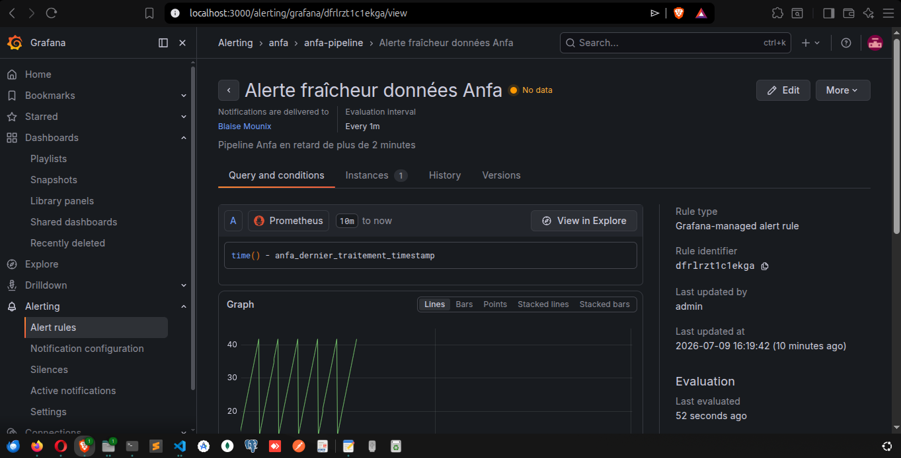

# Rendu Séance 9

**Nom et prénom :** BLAISE Mouné Tchoubou  
**Identifiant GitHub :** Mounix756  
**Date de soumission :** 09/07/2026

---

## Résumé de la séance

Dans cette séance, j'ai déployé une stack Prometheus + Grafana + Node Exporter + cAdvisor + un exportateur métier custom. J'ai instrumenté une métrique de fraîcheur des données du pipeline Anfa (`anfa_dernier_traitement_timestamp`), construit un dashboard Grafana avec un Gauge, configuré une règle d'alerte, et observé le comportement lors d'une panne simulée (arrêt de l'exporter → métrique en `No data` → alerte déclenchée → retour à `Normal` après redémarrage).

Ce que j'ai retenu : Prometheus collecte les métriques en mode pull (il interroge les exportateurs), alors que la plupart des systèmes de monitoring pushent les données. Et Grafana ne stocke rien — il est juste une couche de visualisation au-dessus de Prometheus.

---

## Étapes principales

1. Synchronisation du fork et création de la branche `seance-09`.
2. Lancement de la stack complète : Prometheus, Grafana, Node Exporter, cAdvisor, et l'exportateur custom `anfa-freshness-exporter`.
3. Vérification des 4 targets dans Prometheus sur `http://localhost:9090` → Status → Targets (toutes UP).
4. Import du dashboard Node Exporter Full (ID 1860) dans Grafana.
5. Création du dashboard `Anfa - Monitoring pipeline` avec un panneau Gauge affichant `time() - anfa_dernier_traitement_timestamp`.
6. Simulation de panne : `docker stop anfa-freshness-exporter` → métrique passe en `No data`.
7. Configuration de la règle d'alerte `Alerte fraîcheur données Anfa` avec seuil à 120s, contact point email.
8. Observation de l'alerte en `No data` puis retour à `Normal` après `docker start anfa-freshness-exporter`.

---

## Captures d'écran

### Prometheus — 4 targets UP


### Grafana — Dashboard Node Exporter Full


### Grafana — Gauge fraîcheur (normal)


### Grafana — Gauge fraîcheur (panne simulée)


### Grafana — Alerte configurée


### Grafana — Alerte déclenchée (No data / Firing)


### Grafana — Alerte retour Normal


---

## Difficultés rencontrées

1. **Règles iptables à reconfigurer** : à chaque nouveau `docker compose up`, le réseau Docker change d'ID et les règles FORWARD doivent être recréées manuellement pour que les conteneurs aient accès à internet.

2. **Contact point requis pour sauvegarder une alerte** : Grafana 13 exige un contact point configuré avant de pouvoir sauvegarder une règle d'alerte. Il a fallu créer un contact point email `anfa-default` avant de pouvoir finaliser la règle.

3. **Alerte en No data plutôt que Firing** : quand l'exporter est arrêté, Prometheus n'a plus de données — l'alerte passe en `No data` plutôt qu'en `Firing`. C'est le comportement attendu : sans données, on ne peut pas évaluer si le seuil est dépassé.

---

## Exercices d'application

---

### Exercice 1 : QCM conceptuel

#### 1.1 — Modèle de collecte de Prometheus

**Réponse : B. Pull — Prometheus interroge périodiquement les exportateurs.**

Prometheus va chercher les métriques lui-même en interrogeant le endpoint `/metrics` de chaque cible selon un intervalle de scrape défini. C'est l'inverse de la plupart des systèmes qui pushent vers un serveur central.

---

#### 1.2 — Rôle du Node Exporter

**Réponse : B. Exposer les métriques système (CPU, RAM, disque) de la machine hôte au format Prometheus.**

Node Exporter tourne sur l'hôte et expose un endpoint `/metrics` sur le port 9100. Prometheus scrape ce endpoint pour collecter les métriques système — CPU, mémoire, espace disque, réseau, etc.

---

#### 1.3 — Différence entre Counter et Gauge

**Réponse : B. Un Counter ne fait qu'augmenter ; un Gauge peut monter et descendre.**

Un Counter compte des événements (requêtes reçues, erreurs) — il ne peut que croître ou être remis à zéro. Un Gauge mesure une valeur instantanée (température, mémoire utilisée, fraîcheur des données) qui peut augmenter ou diminuer. La métrique `anfa_dernier_traitement_timestamp` est un Gauge.

---

#### 1.4 — Que fait `time() - anfa_dernier_traitement_timestamp` ?

**Réponse : B. Calcule le nombre de secondes écoulées depuis le dernier traitement réussi.**

`time()` retourne l'heure actuelle en secondes Unix. En soustrayant le timestamp du dernier traitement, on obtient l'âge de la donnée — plus cette valeur est grande, plus les données sont "vieilles".

---

#### 1.5 — Rôle de cAdvisor

**Réponse : B. Exposer les métriques de consommation des conteneurs Docker (CPU, RAM, réseau).**

cAdvisor (Container Advisor) surveille les conteneurs Docker en temps réel et expose leurs métriques au format Prometheus — utile pour voir si un conteneur consomme trop de ressources.

---

#### 1.6 — Que signifie une alerte en état Pending ?

**Réponse : B. La condition est remplie mais la période d'attente (pending period) n'est pas encore écoulée.**

Pour éviter les fausses alertes sur des pics brefs, Grafana attend que la condition soit remplie pendant toute la `pending period` avant de passer en `Firing`. Si la condition disparaît pendant cette période, l'alerte revient à `Normal`.

---

#### 1.7 — Pourquoi Grafana ne stocke-t-il pas les métriques ?

**Réponse : B. Il se connecte à une source de données externe (Prometheus) qui stocke les métriques.**

Grafana est une couche de visualisation — il interroge Prometheus (ou d'autres sources) pour afficher les données. Prometheus est responsable du stockage dans sa base de données time-series locale (TSDB).

---

### Exercice 2 : Lecture et analyse

#### 2.1 — Que fait ce bloc dans prometheus.yml ?

```yaml
scrape_configs:
  - job_name: 'anfa-freshness'
    static_configs:
      - targets: ['anfa-freshness-exporter:8000']
    scrape_interval: 30s
```

Prometheus interroge toutes les 30 secondes le endpoint `http://anfa-freshness-exporter:8000/metrics` pour collecter les métriques de fraîcheur Anfa. Le `job_name` est utilisé comme label pour identifier la source dans les requêtes PromQL.

---

#### 2.2 — Que se passe-t-il si l'exporter est arrêté ?

Prometheus marque la cible comme `DOWN` dans Status → Targets. Les métriques de cette cible ne sont plus mises à jour — elles restent à leur dernière valeur connue pendant la durée de rétention de Prometheus, puis deviennent `stale`. Dans Grafana, le panneau affiche `No data` si aucune donnée récente n'est disponible.

---

#### 2.3 — Pourquoi utiliser un Gauge plutôt qu'un Counter pour la fraîcheur ?

La fraîcheur des données est une valeur qui peut augmenter (données vieillissantes) et diminuer (nouveau traitement réussi → timestamp remis à jour). Un Counter ne peut que croître — il serait inapproprié pour mesurer un âge qui se remet à zéro à chaque traitement réussi.

---

### Exercice 3 : Diagnostic

#### 3.1 — Target en état DOWN dans Prometheus

**Causes possibles :**
- Le conteneur de l'exporter est arrêté
- Le port 8000 n'est pas exposé ou le endpoint `/metrics` ne répond pas
- Le nom d'hôte dans `prometheus.yml` ne correspond pas au nom du service Docker

**Diagnostic :**
```bash
docker compose ps  # vérifier que le conteneur tourne
curl http://localhost:8000/metrics  # vérifier le endpoint
```

---

#### 3.2 — Dashboard Grafana vide (No data)

**Causes possibles :**
- La plage de temps sélectionnée (ex. "Last 24h") ne contient pas de données récentes
- La requête PromQL ne correspond à aucune métrique (faute de frappe dans le nom)
- Prometheus n'a pas encore scrapé la cible

**Solutions :**
- Changer la plage de temps à "Last 5 minutes"
- Vérifier la métrique dans Prometheus Explore (`http://localhost:9090`)
- Attendre le premier intervalle de scrape (30s)

---

#### 3.3 — Alerte toujours en No data même après redémarrage de l'exporter

**Cause :** Prometheus n'a pas encore scrapé l'exporter redémarré. Avec `scrape_interval: 30s`, il faut attendre jusqu'à 30 secondes après le redémarrage.

**Solution :** attendre 1-2 minutes. L'alerte passera de `No data` → `Normal` dès que Prometheus aura collecté une nouvelle valeur.

---

### Exercice 4 : Conception

#### 4.1 — Métriques à instrumenter pour Anfa

| Métrique | Type | Ce qu'elle mesure |
|---|---|---|
| `anfa_trajets_generes_total` | Counter | Nombre total de trajets générés depuis le démarrage |
| `anfa_dernier_traitement_timestamp` | Gauge | Timestamp du dernier traitement réussi |
| `anfa_fichiers_minio_total` | Gauge | Nombre de fichiers dans le bucket anfa-processed |
| `anfa_duree_pipeline_secondes` | Gauge | Durée du dernier run du pipeline en secondes |
| `anfa_erreurs_pipeline_total` | Counter | Nombre total d'erreurs dans le pipeline |

---

#### 4.2 — Règle d'alerte pour détecter un pipeline bloqué

```yaml
alert: AnfaPipelineBloque
expr: time() - anfa_dernier_traitement_timestamp > 3600
for: 5m
labels:
  severity: critical
annotations:
  summary: "Pipeline Anfa bloqué depuis plus d'une heure"
  description: "Le dernier traitement remonte à {{ $value | humanizeDuration }}"
```

**Justification :** le pipeline tourne toutes les nuits — si aucun traitement n'a eu lieu depuis plus d'1 heure (3600s), c'est une anomalie. Le `for: 5m` évite les fausses alertes sur des délais temporaires.

---

### Exercice 5 : Mini-cas d'architecture

#### 5.1 — Stack de monitoring recommandée pour Anfa

```
Exportateurs :
- Node Exporter (métriques système de chaque VM)
- cAdvisor (métriques des conteneurs Docker/Kubernetes)
- Exportateur custom Anfa (fraîcheur données, nb trajets, erreurs pipeline)
- Kafka Exporter (lag des consumers, débit des topics)
- Spark Metrics (durée des jobs, stages en échec)

Prometheus :
- Scrape toutes les cibles toutes les 30s
- Retention 15 jours
- Alertmanager pour le routage des alertes

Grafana :
- Dashboard système (Node Exporter Full)
- Dashboard pipeline Anfa (fraîcheur, jobs Spark, topics Kafka)
- Dashboard business (nb bus actifs, lignes couvertes)

Alertes :
- Pipeline en retard > 2h → email équipe data
- Consumer Kafka lag > 10 000 → Slack ops
- CPU > 90% pendant 5min → PagerDuty astreinte
```

---

#### 5.2 — Pourquoi Prometheus plutôt qu'une simple table de logs ?

Une table de logs enregistre des événements discrets — elle ne permet pas de calculer facilement des tendances, des taux, ou de déclencher des alertes sur des seuils. Prometheus stocke des séries temporelles avec des labels, ce qui permet des requêtes PromQL puissantes (`rate()`, `avg_over_time()`, `histogram_quantile()`). De plus, Prometheus est conçu pour le monitoring temps réel avec des alertes — une table SQL nécessiterait des jobs de requêtes périodiques et une infrastructure supplémentaire.

---

#### 5.3 — Comment éviter les fausses alertes la nuit ?

1. **Pending period** : configurer `for: 30m` au lieu de `for: 5m` pour les alertes nocturnes — un délai passager ne déclenche pas d'alerte.
2. **Silences temporels** : dans Grafana Alerting, créer un "silence" pour la fenêtre de maintenance nocturne (ex. 2h-4h) pendant laquelle le pipeline tourne normalement en batch.
3. **Seuils adaptés** : augmenter le seuil de fraîcheur la nuit (ex. 3600s au lieu de 120s) car le pipeline batch peut prendre plus d'une heure.
4. **Inhibition** : si une alerte "pipeline en maintenance" est active, inhiber toutes les alertes de fraîcheur associées.
