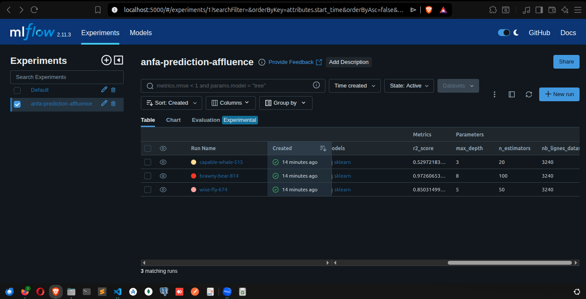
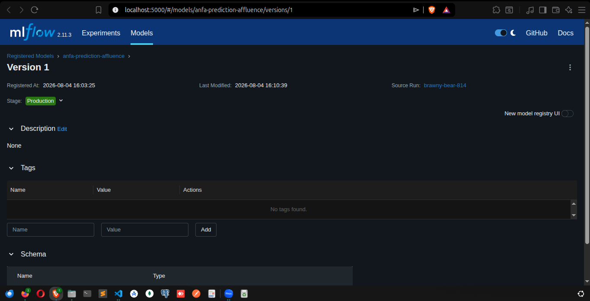

# Rendu — Séance 10

**Nom et prénom :** BLAISE Mouné Tchoubou
**Identifiant GitHub :** Mounix756
**Date de soumission :** 04/08/2026

## Résumé de la séance

Dans cette séance, j'ai déployé un serveur MLflow Tracking via Docker, entraîné 3 variantes d'un modèle RandomForest prédisant l'affluence par ligne et par heure, comparé les runs dans l'UI, enregistré le meilleur (`n_estimators=100, max_depth=8`, R²=0,973) dans le Model Registry et l'ai fait passer en statut Production. J'ai aussi simulé un data drift en bonus (dataset avec heures de pointe décalées), et rédigé la fiche de conformité pour le scénario d'application mobile Anfa.

## Étapes principales

1. Création de la branche `seance-10`, lancement du serveur MLflow Tracking (`docker compose up -d`).
2. Diagnostic et résolution d'une panne réseau Docker empêchant `pip install` dans le conteneur (voir Difficultés).
3. Installation des dépendances côté hôte (`mlflow`, `scikit-learn`, `pandas`) et génération du dataset `dataset_affluence.csv` (~3 240 lignes).
4. Entraînement de 3 variantes du modèle avec des hyperparamètres différents, chacune tracée automatiquement dans l'expérience `anfa-prediction-affluence` :
   - `n_estimators=50, max_depth=5` → MAE=4,71, R²=0,850
   - `n_estimators=100, max_depth=8` → MAE=2,24, R²=0,973 (meilleur)
   - `n_estimators=20, max_depth=3` → MAE=8,33, R²=0,530
5. Comparaison des 3 runs dans l'UI MLflow (colonnes Params/Metrics affichées).
6. Enregistrement du run `100/8` comme modèle `anfa-prediction-affluence` dans le Model Registry, transition en statut **Production**.
7. Bonus : simulation d'un data drift, avec génération d'un second dataset dont les heures de pointe sont décalées de 2h, rechargement du modèle en Production (`models:/anfa-prediction-affluence/Production`) et comparaison de son erreur sur les deux distributions.
8. Rédaction de la fiche de conformité (`FICHE_CONFORMITE.md`) pour le scénario d'application mobile Anfa (géolocalisation + historique mobile money + numéro de téléphone).

## Captures d'écran

### Tableau des 3 runs comparés

### Modèle enregistré en statut Production

## Bonus : simulation de data drift

Résultat du modèle en Production sur les deux distributions (`scripts/simuler_data_drift.py`) :

| Dataset | MAE | R² |
|---|---|---|
| Origine (distribution d'entraînement) | 2,18 | 0,972 |
| Dérivé (heures de pointe décalées de 2h) | 15,08 | **-0,378** |

Le script s'est terminé sans la moindre erreur dans les deux cas. Le modèle a répondu à chaque requête, y compris quand ses prédictions étaient devenues pires qu'une simple moyenne constante (R² négatif). C'est exactement le principe du data drift silencieux : rien ne « plante », le système reste vert, mais les prédictions ne valent plus rien.

## Réflexion personnelle

Le Model Registry répond très concrètement au problème de Kossi. Au lieu de fichiers `test_v2_final.ipynb` dispersés sur son poste, sans savoir lequel a réellement produit le modèle utilisé en prod, n'importe quel script peut charger `models:/anfa-prediction-affluence/Production` sans connaître le numéro de run. La question « quelle version tourne en ce moment ? » a désormais une réponse unique et vérifiable dans le Registry, au lieu de reposer sur la mémoire ou une convention de nommage de fichiers.

Le lien avec Terraform (séance 4) est direct : les deux résolvent le même problème de fond, celui de remplacer une croyance (« je pense que c'est cette version ») par une source de vérité consultable. Le `terraform.tfstate` dit avec certitude ce qui est réellement déployé comme infrastructure ; le stage `Production` du Registry dit avec certitude quelle version du modèle sert réellement les prédictions. Dans les deux cas, versionner ne sert pas juste à garder un historique, ça sert surtout à pouvoir répondre « c'est celle-ci » sans avoir à demander à quelqu'un ou à deviner.

## Difficultés rencontrées

1. **Panne réseau Docker après désinstallation de Docker Desktop** : `pip install mlflow` échouait dans le conteneur avec `Network is unreachable`. Diagnostic approfondi (règles iptables/nftables, conntrack, comparaison hôte vs conteneur) qui a fini par isoler la vraie cause : le réseau WiFi utilisé filtre spécifiquement le trafic TCP routé/NAT'é par le bridge Docker (les connexions directes depuis l'hôte, elles, fonctionnaient). Contourné en passant le service MLflow en `network_mode: host` dans le `docker-compose.yml`, qui fait sortir le conteneur directement par la carte réseau de la machine.

2. **`ModuleNotFoundError: pkg_resources`** au lancement du script d'entraînement : `setuptools` 82 (version installée par défaut) a retiré `pkg_resources`, dont dépend encore `mlflow==2.11.3`. Résolu avec `pip install "setuptools<81" --break-system-packages`.

3. **Bouton "Register Model" / menu Stage introuvables** : la nouvelle UI du Model Registry MLflow (activée par défaut) remplace le menu classique `Stage → Transition to → Production` par un bouton "Promote model" qui fait autre chose (copier vers un autre modèle). Résolu en désactivant le toggle "New model registry UI" en haut à droite de la page du modèle.
